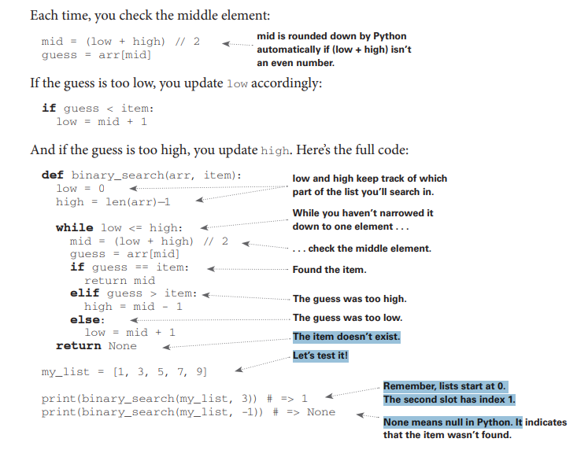

# Azərbaycan dilinə tərcümə

Bu fəsildə ./ Kitabın qalan fəsilləri üçün əsaslar qoyulur . ./ Siz öz ilk axtarış alqoritminizi yazacaqsınız (binar axtarış) . ./ Siz alqoritmin icra müddətinin necə təsvir olunduğunu öyrənəcəksiniz ("Böyük O") . ./ Alqoritmlərin layihələndirilməsində tez-tez tətbiq olunan standart üsul təqdim olunacaq (rekursiya).

# Giriş

Alqoritm dedikdə müəyyən bir tapşırığı yerinə yetirmək üçün təlimatlar toplusu başa düşülür. Prinsipcə, proqram kodunun istənilən hissəsini alqoritm adlandırmaq olar, lakin bu kitabda daha maraqlı mövzular nəzərdən keçirilir. Mən bu kitab üçün alqoritmləri seçərkən onların sürətli olmasına və ya maraqlı məsələləri həll etməsinə... və ya həm birini, həm də digərini eyni zamanda yerinə yetirməsinə diqqət yetirdim. Budur yalnız bir neçə nümunə.

## Məsələlərin həlli haqqında nə öyrənəcəksiniz

• 1-ci fəsildə binar axtarış və alqoritmlərin kodun işini necə sürətləndirə biləcəyi haqqında danışılacaq. Bir nümunədə alqoritm lazım olan əməliyyatların sayını 4 milyard əvəzinə 32-yə endirir!

• GPS cihazı təyinat nöqtəsinə ən qısa yolu hesablamaq üçün qraf nəzəriyyəsindən alqoritmlərdən istifadə edir (bu barədə 6, 7 və 8-ci fəsillərdə).

• Dinamik proqramlaşdırma metodları vasitəsilə (9-cu fəsilə bax) dama oyunu üçün alqoritm yaratmaq olar.

Hər bir halda mən alqoritmi təsvir edəcəyəm və nümunə gətirəcəyəm. Sonra biz alqoritmin icra müddətini "böyük O" anlayışları ilə müzakirə edəcəyik. Sonda eyni alqoritmin tətbiqi ilə həll oluna bilən məsələ növləri nəzərdən keçiriləcək.

---

# Alqoritmlərin səmərəliliyi haqqında nə öyrənəcəksiniz

İndi yaxşı xəbər: çox güman ki, bu kitabdakı hər bir alqoritmin tətbiqi artıq sizin sevimli proqramlaşdırma dilinizdə mövcuddur və hər bir alqoritmi özünüz yazmaq məcburiyyətində qalmayacaqsınız! Lakin əgər onun üstünlüklərini və çatışmazlıqlarını başa düşməsəniz, istənilən tətbiq faydasız olacaq. Bu kitabda siz müxtəlif alqoritmlərin güclü və zəif tərəflərini müqayisə etməyi öyrənəcəksiniz: birləşdirmə çeşidləməsi ilə sürətli çeşidləmə arasında hansı mülahizələrə əsasən seçim etmək lazımdır? Nədən istifadə etmək - massivdən yoxsa siyahıdan? Hətta başqa məlumat strukturunun seçilməsi belə nəticəyə güclü təsir göstərə bilər.

# What you’ll learn about performance

The good news is that an implementation of every algorithm in this
book is probably available in your favorite language, so you don’t
have to write each algorithm yourself! But those implementations are
useless if you don’t understand the tradeoffs. In this book, you’ll learn
to compare tradeoffs between different algorithms: Should you use
merge sort or quicksort? Should you use an array or a list? Just using a
different data structure can make a big difference.

# Məsələlərin həlli haqqında nə öyrənəcəksiniz

Siz indiyə qədər əlçatmaz görünən məsələləri həll etmək üçün texnikalar öyrənəcəksiniz. Məsələn:

• Əgər video oyunları yaratmağı sevirsinizsə, qraf alqoritmlərindən istifadə edərək istifadəçini izləyən süni intellekt sistemi yaza bilərsiniz.

• Siz k-ən yaxın qonşular alqoritmindən istifadə edərək tövsiyə sistemi yaratmağı öyrənəcəksiniz.

• Bəzi məsələlər vaxtında həll oluna bilmir! Bu kitabın NP-tam məsələlər haqqında danışan hissəsi sizə bu cür məsələləri necə müəyyən etməyi və təxmini cavab verən alqoritm yaratmağı göstərir.

Daha ümumi şəkildə, bu kitabın sonunda siz ən geniş tətbiq olunan alqoritmlərdən bəzilərini biləcəksiniz. Sonra öz yeni biliklərinizdən istifadə edərək süni intellekt, məlumat bazaları və s. üçün daha spesifik alqoritmlər haqqında öyrənə bilərsiniz. Və ya işdə daha böyük çağırışları qəbul edə bilərsiniz.

---

## Original text (English)

What you'll learn about solving problems You'll learn techniques for solving problems that might have been out of your grasp until now. For example: • If you like making video games, you can write an AI system that follows the user around using graph algorithms. • You'll learn to make a recommendations system using k-nearest neighbors. • Some problems aren't solvable in a timely manner! The part of this book that talks about NP-complete problems shows you how to identify those problems and come up with an algorithm that gives you an approximate answer. More generally, by the end of this book, you'll know some of the most widely applicable algorithms. You can then use your new knowledge to learn about more specific algorithms for AI, databases, and so on. Or you can take on bigger challenges at work.

# Bilməli olduqlarınız

Bu kitaba başlamazdan əvvəl əsas cəbri bilməlisiniz. Xüsusilə, bu funksiyanı götürək: f(x) = x × 2. f(5) nəyə bərabərdir? Əgər 10 cavabını vermisinizse, hazırsınız.

Bundan əlavə, bir proqramlaşdırma dili ilə tanış olsanız, bu fəsil (və bu kitab) izləmək üçün daha asan olacaq. Bu kitabdakı bütün nümunələr Python dilindədir. Əgər heç bir proqramlaşdırma dili bilmirsinizsə və öyrənmək istəyirsinizsə, Python seçin - o, yeni başlayanlar üçün əladır. Əgər JavaScript kimi başqa dil bilirsinizsə, problem olmayacaq.

---

## Original text (English)

What you need to know You'll need to know basic algebra before starting this book. In particular, take this function: f(x) = x × 2. What is f(5)? If you answered 10, you're set. Additionally, this chapter (and this book) will be easier to follow if you're familiar with one programming language. All the examples in this book are in Python. If you don't know any programming languages and want to learn one, choose Python—it's great for beginners. If you know another language, like JavaScript, you'll be fine.

# Binar axtarış

Tutaq ki, telefon kitabında bir insanı axtarırsınız (nə qədər köhnə cümlə!). Onun adı K hərfi ilə başlayır. Siz əvvəldən başlayıb K hərflərinə çatana qədər səhifələri çevirə bilərsiniz. Lakin çox güman ki, ortadakı səhifədən başlayacaqsınız, çünki bilirsiniz ki, K hərfləri telefon kitabının ortalarında yerləşir. Və ya tutaq ki, lüğətdə O hərfi ilə başlayan sözü axtarırsınız. Yenə də ortaya yaxın yerdən başlayacaqsınız.

İndi tutaq ki, Facebook-a daxil olursunuz. Bunu etdiyiniz zaman Facebook sizin saytda hesabınızın olduğunu yoxlamalıdır. Ona görə də öz məlumat bazasında sizin istifadəçi adınızı axtarmalıdır. Tutaq ki, sizin istifadəçi adınız karlmageddon-dur. Facebook A hərfindən başlayıb sizin adınızı axtara bilər - lakin onun üçün ortalardan başlamaq daha məntiqlidir.

Bu axtarış məsələsidir. Və bütün bu hallar məsələni həll etmək üçün eyni alqoritmdən istifadə edir: binar axtarış.

Binar axtarış bir alqoritmdir; onun girişi çeşidlənmiş elementlər siyahısıdır (sonra izah edəcəyəm ki, niyə çeşidlənmiş olmalıdır). Əgər axtardığınız element həmin siyahıda varsa, binar axtarış onun yerləşdiyi mövqeyi qaytarır. Əks halda, binar axtarış null qaytarır.

---

## Original text (English)

Binary search Suppose you're searching for a person in the phone book (what an oldfashioned sentence!). Their name starts with K. You could start at the beginning and keep flipping pages until you get to the Ks. But you're more likely to start at a page in the middle because you know the Ks are going to be near the middle of the phone book. Or suppose you're searching for a word in a dictionary, and it starts with O. Again, you'll start near the middle. Now, suppose you log on to Facebook. When you do, Facebook has to verify that you have an account on the site. So it needs to search for your username in its database. Suppose your username is karlmageddon. Facebook could start from the As and search for your name—but it makes more sense for it to begin somewhere in the middle. This is a search problem. And all these cases use the same algorithm to solve the problem: binary search. Binary search is an algorithm; its input is a sorted list of elements (I'll explain later why it needs to be sorted). If an element you're looking for is in that list, binary search returns the position where it's located. Otherwise, binary search returns null.

# Binar axtarışın necə işlədiyinə dair nümunə

İndi binar axtarışın necə işlədiyinə dair nümunə. Mən 1 ilə 100 arasında bir rəqəm düşünürəm.

---

## Original text (English)

Now here's an example of how binary search works. I'm thinking of a number between 1 and 100.

# Rəqəm təxmin oyunu

Siz mənim rəqəmimi mümkün qədər az cəhdlə təxmin etməlisiniz. Hər təxmindən sonra mən sizə təxmininizin çox kiçik, çox böyük, yoxsa düzgün olduğunu deyəcəyəm. Tutaq ki, belə təxmin etməyə başlayırsınız: 1, 2, 3, 4, . . . . Belə gedəcək.

---

## Original text (English)

You have to try to guess my number in the fewest tries possible. With every guess, I'll tell you if your guess is too low, too high, or correct. Suppose you start guessing like this: 1, 2, 3, 4, . . . . Here's how it would go.

# Sadə axtarış

Bu sadə axtarışdır (bəlkə də "axmaq axtarış" daha yaxşı termin olardı). Hər təxminlə siz yalnız bir rəqəmi aradan qaldırırsınız. Əgər mənim rəqəmim 99 olsaydı, ona çatmaq üçün sizə 99 təxmin lazım ola bilərdi!

---

## Original text (English)

This is simple search (maybe stupid search would be a better term). With each guess, you're eliminating only one number. If my number was 99, it could take you 99 guesses to get there!

# Daha yaxşı axtarış üsulu

Budur daha yaxşı texnika. 50 ilə başlayın. Çox kiçikdir, lakin siz indicə rəqəmlərin yarısını aradan qaldırdınız! İndi bilirsiniz ki, 1-50 arası hamısı çox kiçikdir. Növbəti təxmin: 75. Çox böyükdür, lakin yenə də qalan rəqəmlərin yarısını kəsdiniz! Binar axtarışla siz orta rəqəmi təxmin edirsiniz və hər dəfə qalan rəqəmlərin yarısını aradan qaldırırsınız. Növbəti 63-dür (50 ilə 75 arasının ortası).

---

## Original text (English)

A better way to search Here's a better technique. Start with 50. Too low, but you just eliminated half the numbers! Now you know that 1–50 are all too low. Next guess: 75. Too high, but again you cut down half the remaining numbers! With binary search, you guess the middle number and eliminate half the remaining numbers every time. Next is 63 (halfway between 50 and 75).

# Binar axtarış

Bu binar axtarışdır. Siz indicə ilk alqoritminizi öyrəndiniz! Budur hər dəfə neçə rəqəmi aradan qaldıra biləcəyiniz. Hansı rəqəmi düşünməyimdən asılı olmayaraq, siz maksimum yeddi təxminlə tapa bilərsiniz - çünki hər təxminlə çox sayda rəqəmi aradan qaldırırsınız!

Tutaq ki, lüğətdə söz axtarırsınız. Lüğətdə 240,000 söz var. Ən pis halda, hər axtarışın neçə addım atacağını düşünürsünüz? Sadə axtarış 240,000 addım ata bilər, əgər axtardığınız söz kitabın ən sonuncusudursa. Binar axtarışın hər addımında siz sözlərin sayını yarıya bölürsünüz, ta ki yalnız bir söz qalana qədər.

---

## Original text (English)

This is binary search. You just learned your first algorithm! Here's how many numbers you can eliminate every time. Whatever number I'm thinking of, you can guess in a maximum of seven guesses—because you eliminate so many numbers with every guess! Suppose you're looking for a word in the dictionary. The dictionary has 240,000 words. In the worst case, how many steps do you think each search will take? Simple search could take 240,000 steps if the word you're looking for is the very last one in the book. With each step of binary search, you cut the number of words in half until you're left with only one word.

# Binar axtarışın mürəkkəbliyi

Beləliklə, binar axtarış 18 addım atacaq - böyük fərq! Ümumiyyətlə, n elementli istənilən siyahı üçün binar axtarış ən pis halda log₂ n addım atacaq, halbuki sadə axtarış n addım atacaq.

---

## Original text (English)

So binary search will take 18 steps—a big difference! In general, for any list of n, binary search will take log2 n steps to run in the worst case, whereas simple search will take n steps.

## Izah

log₂(n) nə deməkdir?
log₂(n), ədədi neçə dəfə 2-yə vurmaqla əldə etdiyimizi göstərir.

Başqa sözlə:
log₂(n) = k, əgər 2^k = n
log₂(1) = 0 çünki 2^0 = 1

log₂(2) = 1 çünki 2^1 = 2

log₂(4) = 2 çünki 2^2 = 4

log₂(8) = 3 çünki 2^3 = 8

log₂(16) = 4 çünki 2^4 = 16

Yəni log₂ funksiyası tərsindən eksponent funksiyasıdır.

# Loqariflər

Loqariflərin nə olduğunu xatırlamaya bilərsiniz, lakin çox güman ki, üstlü ədədlərin nə olduğunu bilirsiniz. log₁₀ 100 belə sual verməyə bənzəyir: "100 əldə etmək üçün neçə 10-u bir-birinə vururuq?" Cavab 2-dir: 10 × 10. Beləliklə log₁₀ 100 = 2. Loqariflər üstlü ədədlərin tərsidir.

Bu kitabda böyük O notasiyasında (bir az sonra izah ediləcək) icra müddətindən danışdığım zaman, log həmişə log₂ deməkdir.

Sadə axtarışla element axtardığınız zaman, ən pis halda, hər bir elementə baxmaq məcburiyyətində qala bilərsiniz. Beləliklə, səkkiz rəqəmdən ibarət siyahı üçün maksimum səkkiz rəqəmi yoxlamalı olacaqsınız. Binar axtarış üçün ən pis halda log n elementi yoxlamalısınız. Səkkiz elementdən ibarət siyahı üçün log 8 == 3, çünki 2³ == 8. Beləliklə, səkkiz rəqəmdən ibarət siyahı üçün maksimum üç rəqəmi yoxlamalı olacaqsınız.

1,024 elementdən ibarət siyahı üçün log 1,024 = 10, çünki 2¹⁰ == 1,024. Beləliklə, 1,024 rəqəmdən ibarət siyahı üçün maksimum 10 rəqəmi yoxlamalı olacaqsınız.

---

## Original text (English)

Logarithms You may not remember what logarithms are, but you probably know what exponentials are. log10 100 is like asking, "How many 10s do we multiply together to get 100?" The answer is 2: 10 × 10. So log10 100 = 2. Logs are the inverse of exponentials. Logs are the inverse of exponentials. In this book, when I talk about running time in big O notation (explained a little later), log always means log2 . When you search for an element using simple search, in the worst case, you might have to look at every single element. So for a list of eight numbers, you'd have to check eight numbers at most. For binary search, you have to check log n elements in the worst case. For a list of eight elements, log 8 == 3, because 23 == 8. So for a list of eight numbers, you would have to check three numbers at most. For a list of 1,024 elements, log 1,024 = 10, because 210 == 1,024. So for a list of 1,024 numbers, you'd have to check 10 numbers at most.

# Qeyd

Bu kitabda log müddətindən çox danışacağam, ona görə də loqariflərin konsepsiyasını başa düşməlisiniz. Əgər başa düşmürsünüzsə, Khan Academy (https://khanacademy.org) saytında bunu aydın şəkildə izah edən gözəl video var.

---

## Original text (English)

Note I'll talk about log time a lot in this book, so you should understand the concept of logarithms. If you don't, Khan Academy (https://khanacademy.org) has a nice video that makes it clear.

# Qeyd

Binar axtarış yalnız siyahınız çeşidlənmiş qaydada olduqda işləyir. Məsələn, telefon kitabındakı adlar əlifba sırası ilə çeşidlənib, ona görə də ad axtarmaq üçün binar axtarışdan istifadə edə bilərsiniz. Əgər adlar çeşidlənməmiş olsaydı nə baş verərdi?

---

## Original text (English)

Note Binary search only works when your list is in sorted order. For example, the names in a phone book are sorted in alphabetical order, so you can use binary search to look for a name. What would happen if the names weren't sorted?

# Python-da binar axtarışın necə yazılacağına baxaq

Buradakı kod nümunəsi massivlərdən istifadə edir. Əgər massivlərin necə işlədiyini bilmirsinizsə, narahat olmayın; onlar növbəti fəsildə əhatə olunur. Sadəcə bilməlisiniz ki, elementlərin ardıcıllığını massiv adlanan ardıcıl vedrələr sırasında saxlaya bilərsiniz. Vedrələr 0-dan başlayaraq nömrələnir: birinci vedrə 0 mövqeyindədir, ikincisi 1-də, üçüncüsü 2-də və s.

---

## Original text (English)

Let's see how to write binary search in Python. The code sample here uses arrays. If you don't know how arrays work, don't worry; they're covered in the next chapter. You just need to know that you can store a sequence of elements in a row of consecutive buckets called an array. The buckets are numbered starting with 0: the first bucket is at position 0, the second is at 1, the third is at 2, and so on.

# Qeyd

Kodda "list" və "array" terminlərini bir-birinin yerinə işlətdiyimi görəcəksiniz. Bu ona görədir ki, Python-da massivlər "list" adlanır.

---

## Original text (English)

Note You will see me use the terms list and array interchangeably in the code. This is because in Python, arrays are called lists.

# Binary search funksiyası

`binary_search` funksiyası çeşidlənmiş massiv və element qəbul edir. Əgər element massivdə varsa, funksiya onun mövqeyini qaytarır. Siz massivin hansı hissəsini axtarmalı olduğunuzu izləyəcəksiniz. Əvvəldə bu, bütün massivdir:

---

## Original text (English)

The binary_search function takes a sorted array and an item. If the item is in the array, the function returns its position. You'll keep track of what part of the array you have to search through. At the beginning, this is the entire array:

low = 0
high = len(arr) - 1



burada

```js
const number_ = [1, 2, 3, 4, 5, 6, 7, 8, 9, 10];

function binarySearch(list, item) {
  let low = 0;
  let high = list.length - 1;
  while (low <= high) {
    let mid = Math.floor((low + high) / 2);
    let gues = list[mid];

    if (gues === item) {
      return mid;
    } else if (gues > item) {
      high = mid - 1;
    } else {
      low = mid + 1;
    }
  }
  return null;
}

console.log(binarySearch(number_, 8));
```
