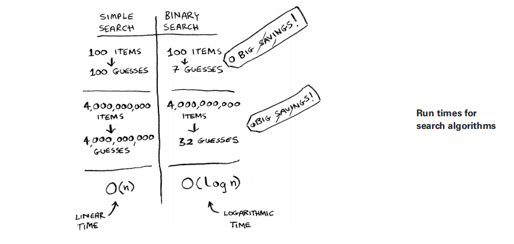
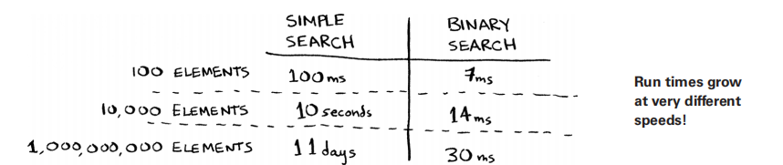
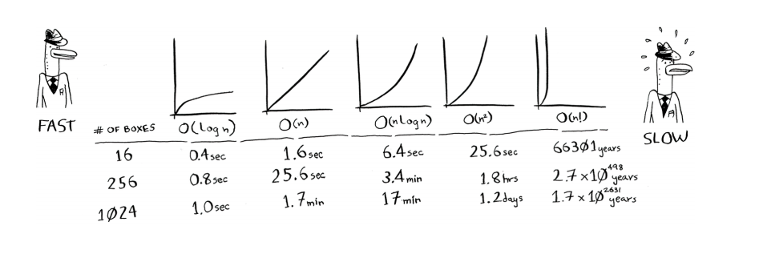

# İcra müddəti

Alqoritm haqqında danışdığım hər dəfə onun icra müddətini müzakirə edəcəyəm. Ümumiyyətlə, siz ən səmərəli alqoritmi seçmək istəyirsiniz - istər vaxt, istərsə də yaddaş üçün optimallaşdırmağa çalışın.

Binar axtarışa qayıdaq. Ondan istifadə etməklə nə qədər vaxta qənaət edirsiniz? Yaxşı, ilk yanaşma hər bir rəqəmi bir-bir yoxlamaq idi. Əgər bu 100 rəqəmdən ibarət siyahıdırsa, maksimum 100 təxmin tələb edir. Əgər bu 4 milyard rəqəmdən ibarət siyahıdırsa, maksimum 4 milyard təxmin tələb edir. Beləliklə, maksimum təxmin sayı siyahının ölçüsü ilə eynidir. Buna xətti vaxt deyilir.

Binar axtarış fərqlidir. Əgər siyahı 100 elementdən ibarətdirsə, maksimum yeddi təxmin tələb edir. Əgər siyahı 4 milyard elementdən ibarətdirsə, maksimum 32 təxmin tələb edir. Güclüdür, elə deyilmi? Binar axtarış loqarifmik vaxtda (və ya əksər insanların dediyi kimi, log vaxtında) işləyir. Budur bu günkü tapıntılarımızı ümumiləşdirən bir cədvəl.

---

## Original text (English)

# Running time

Any time I talk about an algorithm, I'll discuss its running time. Generally, you want to choose the most efficient algorithm—whether you're trying to optimize for time or space.

Back to binary search. How much time do you save by using it? Well, the first approach was to check each number, one by one. If this is a list of 100 numbers, it takes up to 100 guesses. If it's a list of 4 billion numbers, it takes up to 4 billion guesses. So the maximum number of guesses is the same as the size of the list. This is called linear time.

Binary search is different. If the list is 100 items long, it takes at most seven guesses. If the list is 4 billion items, it takes at most 32 guesses. Powerful, eh? Binary search runs in logarithmic time (or log time, as most people call it). Here's a table summarizing our findings today.

# Böyük O notasiyası

Böyük O notasiyası alqoritmin nə qədər sürətli olduğunu göstərən xüsusi bir notasiyadır. Kimə lazımdır? Yaxşı, məlum olur ki, siz başqalarının alqoritmlərindən tez-tez istifadə edəcəksiniz - və bunu etdiyiniz zaman onların nə qədər sürətli və ya yavaş olduğunu başa düşmək yaxşıdır. Bu bölmədə mən böyük O notasiyasının nə olduğunu izah edəcəyəm və sizə ondan istifadə edərək alqoritmlər üçün ən çox yayılmış icra müddətlərinin siyahısını verəcəyəm.

---

## Original text (English)

# Big O notation

Big O notation is special notation that tells you how fast an algorithm is. Who cares? Well, it turns out that you'll use other people's algorithms often—and when you do, it's nice to understand how fast or slow they are. In this section, I'll explain what big O notation is and give you a list of the most common running times for algorithms using it.

# Alqoritmlərin icra müddətləri müxtəlif sürətlə artır

Bob NASA üçün axtarış alqoritmi yazır. Onun alqoritmi raket Ayda enməyə hazırlaşarkən işə düşəcək və eniş yerini hesablamağa kömək edəcək.

Bu, iki alqoritmin icra müddətinin müxtəlif sürətlə necə arta biləcəyinə dair bir nümunədir. Bob sadə axtarış və binar axtarış arasında seçim etməyə çalışır. Alqoritm həm sürətli, həm də düzgün olmalıdır. Bir tərəfdən, binar axtarış daha sürətlidir. Və Bobun eniş yerini tapmaq üçün cəmi 10 saniyəsi var - əks halda, raket kursdan çıxacaq. Digər tərəfdən, sadə axtarışı yazmaq daha asandır və səhvlərin yaranma ehtimalı daha azdır. Və Bob həqiqətən də raketin enişi üçün kodda səhvlərin olmasını istəmir! Əlavə ehtiyatlı olmaq üçün Bob hər iki alqoritmi 100 elementdən ibarət siyahı ilə sınaqdan keçirməyə qərar verir.

Fərz edək ki, bir elementi yoxlamaq 1 ms çəkir. Sadə axtarışla Bob 100 elementi yoxlamalıdır, buna görə də axtarışın icrası 100 ms çəkir. Digər tərəfdən, binar axtarışla o, yalnız yeddi elementi yoxlamalıdır (log₂ 100 təxminən 7-dir), buna görə də bu axtarışın icrası 7 ms çəkir. Lakin real olaraq, siyahıda bir milyard element ola bilər. Əgər belə olarsa, sadə axtarış nə qədər vaxt çəkəcək? Binar axtarış nə qədər vaxt çəkəcək? Oxumağa davam etməzdən əvvəl hər suala cavabınız olduğundan əmin olun.

---

## Original text (English)

# Algorithm running times grow at different rates

Bob is writing a search algorithm for NASA. His algorithm will kick in when a rocket is about to land on the Moon, and it will help calculate where to land. This is an example of how the run time of two algorithms can grow at different rates. Bob is trying to decide between simple search and binary search. The algorithm needs to be both fast and correct. On one hand, binary search is faster. And Bob has only 10 seconds to figure out where to land—otherwise, the rocket will be off course. On the other hand, simple search is easier to write, and there is less chance of bugs being introduced. And Bob really doesn’t want bugs in the code to land a rocket! To be extra careful, Bob decides to time both algorithms with a list of 100 elements. Let’s assume it takes 1 ms to check one element. With simple search, Bob has to check 100 elements, so the search takes 100 ms to run. On the other hand, he only has to check seven elements with binary search (log2 100 is roughly 7), so that search takes 7 ms to run. But realistically, the list will have more like a billion elements. If it does, how long will simple search take? How long will binary search take? Make sure you have an answer for each question before reading on.

# Bobun qərarı

Bob binar axtarışı 1 milyard elementlə işə salır və bu, 30 ms çəkir (log₂ 1,000,000,000 təxminən 30-dur). "Otuz millisaniyə!" o düşünür. "Binar axtarış sadə axtarışdan təxminən 15 dəfə sürətlidir, çünki sadə axtarış 100 elementlə 100 ms çəkdi, binar axtarış isə 7 ms. Deməli, sadə axtarış 30 × 15 = 450 ms çəkəcək, düzdürmü? 10 saniyəlik həddimdən xeyli aşağı." Bob sadə axtarışı seçməyə qərar verir. Bu, düzgün seçimdirmi?

---

## Original text (English)

# Bob's Decision

Bob runs binary search with 1 billion elements, and it takes 30 ms (log2 1,000,000,000 is roughly 30). "Thirty milliseconds!" he thinks. "Binary search is about 15 times faster than simple search because simple search took 100 ms with 100 elements, and binary search took 7 ms. So simple search will take 30 × 15 = 450 ms, right? Way under my threshold of 10 seconds." Bob decides to go with simple search. Is that the right choice?

# Xeyr.

Məlum olur ki, Bob səhv edir. Tamamilə səhv. Sadə axtarışın 1 milyard elementlə icra müddəti 1 milyard ms olacaq ki, bu da 11 gündür! Problem ondadır ki, binar axtarışın və sadə axtarışın icra müddətləri eyni sürətlə artmır.

---

## Original text (English)

# No.

Turns out that Bob is wrong. Dead wrong. The run time for simple search with 1 billion items will be 1 billion ms, which is 11 days! The problem is that the run times for binary search and simple search don’t grow at the same rate.

# Böyük O notasiyası: Artım sürəti

Yəni, elementlərin sayı artdıqca, binar axtarışın işləməsi bir qədər daha çox vaxt aparır. Lakin sadə axtarışın işləməsi xeyli daha çox vaxt aparır. Beləliklə, rəqəmlər siyahısı böyüdükcə, binar axtarış qəfildən sadə axtarışdan xeyli sürətli olur. Bob binar axtarışın sadə axtarışdan 15 dəfə sürətli olduğunu düşünürdü, lakin bu düzgün deyil. Əgər siyahıda 1 milyard element varsa, bu, təxminən 33 milyon dəfə daha sürətlidir. Buna görə də alqoritmin işləməsi üçün nə qədər vaxt lazım olduğunu bilmək kifayət deyil - siyahının ölçüsü artdıqca icra müddətinin necə artdığını bilməlisiniz. Böyük O notasiyası burada köməyə gəlir.

Böyük O notasiyası alqoritmin nə qədər sürətli olduğunu göstərir. Məsələn, tutaq ki, n ölçülü bir siyahınız var. Sadə axtarış hər elementi yoxlamalıdır, buna görə də n əməliyyat tələb edəcək. Böyük O notasiyasında icra müddəti O(n)-dir. Saniyələr haradadır? Heç yoxdur - böyük O sizə sürəti saniyələrlə bildirmir. Böyük O notasiyası əməliyyatların sayını müqayisə etməyə imkan verir. O, alqoritmin nə qədər sürətlə böyüdüyünü göstərir.

---

## Original text (English)

# Big O notation: Growth Rate

That is, as the number of items increases, binary search takes a little more time to run. But simple search takes a lot more time to run. So as the list of numbers gets bigger, binary search suddenly becomes a lot faster than simple search. Bob thought binary search was 15 times faster than simple search, but that’s not correct. If the list has 1 billion items, it’s more like 33 million times faster. That’s why it’s not enough to know how long an algorithm takes to run—you need to know how the running time increases as the list size increases. That’s where big O notation comes in.

Big O notation tells you how fast an algorithm is. For example, suppose you have a list of size n. Simple search needs to check each element, so it will take n operations. The run time in big O notation is O(n). Where are the seconds? There are none—big O doesn’t tell you the speed in seconds. Big O notation lets you compare the number of operations. It tells you how fast the algorithm grows.

# Binar axtarışın Böyük O notasiyası

Binar axtarış n ölçülü bir siyahını yoxlamaq üçün log n əməliyyat tələb edir. Böyük O notasiyasında icra müddəti nədir? Bu, O(log n)-dir. Ümumiyyətlə, böyük O notasiyası aşağıdakı kimi yazılır.

---

## Original text (English)

# Binary search Big O notation

Binary search needs log n operations to check a list of size n. What's the running time in big O notation? It's O(log n). In general, big O notation is written as follows.

# Böyük O notasiyası: Nümunələr

Bu notasiya alqoritmin edəcəyi əməliyyatların sayını göstərir. Ona böyük O notasiyası deyilir, çünki əməliyyatların sayının qarşısına "böyük O" qoyulur (zarafat kimi səslənir, amma doğrudur!).

İndi bəzi nümunələrə baxaq. Bu alqoritmlərin icra müddətini tapmağa çalışın.

---

## Original text (English)

# Big O notation: Examples

This notation tells you the number of operations an algorithm will make. It's called big O notation because you put a "big O" in front of the number of operations (it sounds like a joke, but it's true!). Now, let's look at some examples. See if you can figure out the run time for these algorithms.

# Müxtəlif böyük O icra müddətlərini vizuallaşdırmaq

Budur evdə bir neçə vərəq və qələmlə tətbiq edə biləcəyiniz praktiki bir nümunə. Tutaq ki, 16 qutudan ibarət bir şəbəkə çəkməlisiniz.

## Alqoritm 1

Bunu etməyin bir yolu 16 qutunu bir-bir çəkməkdir. Unutmayın, böyük O notasiyası əməliyyatların sayını sayır. Bu nümunədə bir qutu çəkmək bir əməliyyatdır. Siz 16 qutu çəkməlisiniz. Bir qutunu bir dəfəyə çəkməklə neçə əməliyyat tələb olunacaq?

---

## Original text (English)

# Visualizing different big O run times

Here's a practical example you can follow at home with a few pieces of paper and a pencil. Suppose you have to draw a grid of 16 boxes.

## Algorithm 1

One way to do it is to draw 16 boxes, one at a time. Remember, big O notation counts the number of operations. In this example, drawing one box is one operation. You have to draw 16 boxes. How many operations will it take, drawing one box at a time?

# Alqoritm 1-in icra müddəti

16 qutu çəkmək üçün 16 addım tələb olunur. Bu alqoritmin icra müddəti nədir?

Bu alqoritmin icra müddəti **O(n)**-dir. Çünki əməliyyatların sayı (qutuların sayı) girişin ölçüsü (n) ilə düz mütənasibdir. Əgər n qutu çəkməli olsaydınız, n əməliyyat tələb olunacaqdı.

---

## Original text (English)

# Algorithm 1 Running Time

It takes 16 steps to draw 16 boxes. What's the running time for this algorithm?

# Alqoritm 2

Bunun əvəzinə bu alqoritmi sınayın. Kağızı qatlayın.

Bu nümunədə kağızı bir dəfə qatlamaq bir əməliyyatdır. Siz bu əməliyyatla indicə iki qutu yaratdınız!

Kağızı yenidən, yenidən və yenidən qatlayın.

Dörd qatlamadan sonra onu açın və gözəl bir şəbəkə əldə edəcəksiniz! Hər qatlama qutuların sayını ikiqat artırır. Siz dörd əməliyyatla 16 qutu yaratdınız! Hər qatlama ilə iki dəfə çox qutu "çəkə" bilərsiniz, beləliklə 16 qutunu dörd addımda çəkə bilərsiniz. Bu alqoritmin icra müddəti nədir? Davam etməzdən əvvəl hər iki alqoritm üçün icra müddətlərini tapın.

Cavablar: Alqoritm 1 O(n) vaxtı, Alqoritm 2 isə O(log n) vaxtı tələb edir.

---

## Original text (English)

# Algorithm 2

Try this algorithm instead. Fold the paper. In this example, folding the paper once is an operation. You just made two boxes with that operation! Fold the paper again, and again, and again. Unfold it after four folds, and you’ll have a beautiful grid! Every fold doubles the number of boxes. You made 16 boxes with four operations! You can “draw” twice as many boxes with every fold, so you can draw 16 boxes in four steps. What’s the running time for this algorithm? Come up with running times for both algorithms before moving on. Answers: Algorithm 1 takes O(n) time, and algorithm 2 takes O(log n) time.

# Böyük O ən pis halda icra müddətini müəyyən edir

Tutaq ki, telefon kitabında bir insanı axtarmaq üçün sadə axtarışdan istifadə edirsiniz. Siz bilirsiniz ki, sadə axtarış O(n) vaxtı tələb edir, bu o deməkdir ki, ən pis halda, telefon kitabınızdakı hər bir qeydə baxmalı olacaqsınız. Bu halda, siz Aditi axtarırsınız. Bu adam telefon kitabınızdakı ilk qeyddir. Beləliklə, hər qeydə baxmaq məcburiyyətində qalmadınız - onu ilk cəhddə tapdınız. Bu alqoritm O(n) vaxtı tələb etdimi? Yoxsa O(1) vaxtı tələb etdi, çünki siz insanı ilk cəhddə tapdınız?

Sadə axtarış hələ də O(n) vaxtı tələb edir. Bu halda, axtardığınızı dərhal tapdınız. Bu, ən yaxşı hal ssenarisidir. Lakin biz ən pis hal ssenarisinin analizi üçün böyük O notasiyasından istifadə edirik. Beləliklə, deyə bilərsiniz ki, ən pis halda, telefon kitabındakı hər bir qeydə bir dəfə baxmalı olacaqsınız. Bu, O(n) vaxtıdır. Bu bir təminatdır - siz bilirsiniz ki, sadə axtarış heç vaxt O(n) vaxtından daha yavaş olmayacaq.

---

## Original text (English)

# Big O establishes a worst-case run time

Suppose you're using simple search to look for a person in the phone book. You know that simple search takes O(n) time to run, which means, in the worst case, you'll have to look through every single entry in your phone book. In this case, you're looking for Adit. This guy is the first entry in your phone book. So you didn't have to look at every entry—you found it on the first try. Did this algorithm take O(n) time? Or did it take O(1) time because you found the person on the first try?

Simple search still takes O(n) time. In this case, you found what you were looking for instantly. That's the best-case scenario. But we are using big O notation for worst-case scenario analysis. So you can say that in the worst case, you'll have to look at every entry in the phone book once. That's O(n) time. It's a reassurance—you know that simple search will never be slower than O(n) time.

# Qeyd

Ən pis halda icra müddəti ilə yanaşı, orta halda icra müddətinə də baxmaq vacibdir. Ən pis hal ilə orta hal arasındakı fərq 4-cü fəsildə müzakirə olunur.

## Bəzi ümumi böyük O icra müddətləri

Budur tez-tez qarşılaşacağınız beş böyük O icra müddəti, ən sürətlidən ən yavaşa doğru sıralanmışdır:

*   **O(log n)**, həmçinin log vaxtı kimi tanınır. Nümunə: binar axtarış.
*   **O(n)**, həmçinin xətti vaxt kimi tanınır. Nümunə: sadə axtarış.
*   **O(n * log n)**. Nümunə: sürətli çeşidləmə alqoritmi, məsələn, quicksort (4-cü fəsildə gələcək).
*   **O(n²)**. Nümunə: yavaş çeşidləmə alqoritmi, məsələn, selection sort (2-ci fəsildə gələcək).
*   **O(n!)**. Nümunə: həqiqətən yavaş alqoritm, məsələn, səyyah satıcı problemi (növbəti gələcək!).

Tutaq ki, siz yenidən 16 qutudan ibarət bir şəbəkə çəkirsiniz və bunu etmək üçün beş müxtəlif alqoritmdən birini seçə bilərsiniz. Əgər birinci alqoritmdən istifadə etsəniz, şəbəkəni çəkmək sizə O(log n) vaxtı aparacaq. Siz saniyədə 10 əməliyyat edə bilərsiniz. O(log n) vaxtı ilə 16 qutudan ibarət şəbəkə çəkmək sizə dörd əməliyyat aparacaq (log₂ 16 4-dür). Beləliklə, şəbəkəni çəkmək sizə 0.4 saniyə çəkəcək. Bəs 1,024 qutu çəkməli olsanız? 1,024 qutudan ibarət şəbəkə çəkmək sizə log₂ 1,024 = 10 əməliyyat, yəni 1 saniyə çəkəcək. Bu rəqəmlər birinci alqoritmdən istifadə edir.

İkinci alqoritm daha yavaşdır: O(n) vaxtı tələb edir. 16 qutu çəkmək 16 əməliyyat, 1,024 qutu çəkmək isə 1,024 əməliyyat tələb edəcək. Bu, saniyələrlə nə qədər vaxtdır?

Budur qalan alqoritmlər üçün şəbəkə çəkməyin nə qədər vaxt aparacağı, ən sürətlidən ən yavaşa doğru:

---

## Original text (English)

# Note

Along with the worst-case run time, it’s also important to look at the average case run time. Worst case versus average case is discussed in chapter 4.

## Some common big O run times

Here are five big O run times that you’ll encounter a lot, sorted from fastest to slowest:
• O(log n), also known as log time. Example: binary search.
• O(n), also known as linear time. Example: simple search.
• O(n * log n). Example: a fast sorting algorithm, like quicksort (coming up in chapter 4).
• O(n2). Example: a slow sorting algorithm, like selection sort (coming up in chapter 2).
• O(n!). Example: a really slow algorithm, like the traveling salesperson (coming up next!).

Suppose you’re drawing a grid of 16 boxes again, and you can choose from five different algorithms to do so. If you use the first algorithm, it will take you O(log n) time to draw the grid. You can do 10 operations per second. With O(log n) time, it will take you four operations to draw a grid of 16 boxes (log 16 is 4). So it will take you 0.4 seconds to draw the grid. What if you have to draw 1,024 boxes? It will take you log 1,024 = 10 operations, or 1 second, to draw a grid of 1,024 boxes. These numbers are using the first algorithm.

The second algorithm is slower: it takes O(n) time. It will take 16 operations to draw 16 boxes, and it will take 1,024 operations to draw 1,024 boxes. How much time is that in seconds?

Here’s how long it would take to draw a grid for the rest of the algorithms, from fastest to slowest:

# Digər icra müddətləri

Başqa icra müddətləri də var, lakin bunlar ən çox yayılmış beşidir. Bu izahat sadələşdirilmişdir. Reallıqda, böyük O icra müddətindən əməliyyatların sayına bu qədər səliqəli şəkildə çevirmək mümkün deyil, lakin indilik bu kifayətdir. Bir neçə alqoritm öyrəndikdən sonra 4-cü fəsildə böyük O notasiyasına qayıdacağıq. İndilik əsas nəticələr aşağıdakılardır:

*   Alqoritmin sürəti saniyələrlə deyil, əməliyyatların sayının artımı ilə ölçülür.
*   Saniyələr əvəzinə, girişin ölçüsü artdıqca alqoritmin icra müddətinin nə qədər sürətlə artdığı haqqında danışırıq.
*   Alqoritmlərin icra müddəti böyük O notasiyasında ifadə edilir.
*   O(log n) O(n)-dən daha sürətlidir və axtardığınız elementlər siyahısı böyüdükcə xeyli sürətlənir.

---

## Original text (English)

# Other run times

There are other run times, too, but these are the five most common. This explanation is a simplification. In reality, you can’t convert from a big O run time to a number of operations this neatly, but this is good enough for now. We’ll come back to big O notation in chapter 4, after you’ve learned a few more algorithms. For now, the main takeaways are as follows:
• Algorithm speed isn’t measured in seconds but in growth of the number of operations.
• Instead of seconds, we talk about how quickly the run time of an algorithm increases as the size of the input increases.
• Run time of algorithms is expressed in big O notation.
• O(log n) is faster than O(n), and it gets a lot faster as the list of items you’re searching grows.

# TAPŞIRIQLAR

Aşağıdakı hər bir ssenari üçün icra müddətini böyük O notasiyası ilə göstərin.

**1.3** Sizin bir adınız var və telefon kitabında həmin şəxsin telefon nömrəsini tapmaq istəyirsiniz.

**Cavab:** Telefon kitabında adlar əlifba sırası ilə çeşidlənmişdir. Buna görə də, binar axtarışdan istifadə edə bilərsiniz.
**O(log n)**

**1.4** Sizin bir telefon nömrəniz var və telefon kitabında həmin şəxsin adını tapmaq istəyirsiniz. (İpucu: Bütün kitabı axtarmalı olacaqsınız!)

**Cavab:** Telefon nömrələri adətən çeşidlənmiş olmur. Buna görə də, hər bir qeydə baxmalı olacaqsınız.
**O(n)**

**1.5** Telefon kitabındakı hər bir şəxsin nömrələrini oxumaq istəyirsiniz.

**Cavab:** Hər bir qeydə bir dəfə baxmalı olacaqsınız.
**O(n)**

**1.6** Yalnız A hərfi ilə başlayan şəxslərin nömrələrini oxumaq istəyirsiniz. (Bu çətin bir sualdır! Bu, 4-cü fəsildə daha ətraflı əhatə olunan konsepsiyaları əhatə edir. Cavabı oxuyun - təəccüblənə bilərsiniz!)

**Cavab:** Əvvəlcə A hərfi ilə başlayan ilk qeydi tapmaq üçün binar axtarışdan istifadə edə bilərsiniz (O(log n)). Sonra A hərfi ilə başlayan bütün qeydləri oxumaq üçün xətti şəkildə irəliləməlisiniz. Əgər A hərfi ilə başlayan `k` sayda qeyd varsa, bu, O(k) vaxtı tələb edəcək. Ümumi icra müddəti O(log n + k) olacaq. Ən pis halda, bütün kitab A hərfi ilə başlayan adlardan ibarət ola bilər (yəni k = n), bu halda O(n) olar. Lakin ümumiyyətlə, bu, O(n)-dən daha sürətli olacaq, çünki yalnız müəyyən bir hissəyə baxırsınız.
**O(n)** (Ən pis halda, bütün siyahını keçməli ola bilərsiniz, məsələn, əgər bütün adlar A hərfi ilə başlayırsa. Daha dəqiq desək, O(log n + k), burada k A hərfi ilə başlayan adların sayıdır. Lakin Böyük O notasiyasında dominant termin O(n) olacaq, çünki k ən pis halda n-ə bərabər ola bilər.)

---

## Original text (English)

# EXERCISES

Give the run time for each of these scenarios in terms of big O.

**1.3** You have a name, and you want to find the person’s phone number in the phone book.

**1.4** You have a phone number, and you want to find the person’s name in the phone book. (Hint: You’ll have to search through the whole book!)

**1.5** You want to read the numbers of every person in the phone book.

**1.6** You want to read the numbers of just the As. (This is a tricky one! It involves concepts that are covered more in chapter 4. Read the answer—you may be surprised!)

