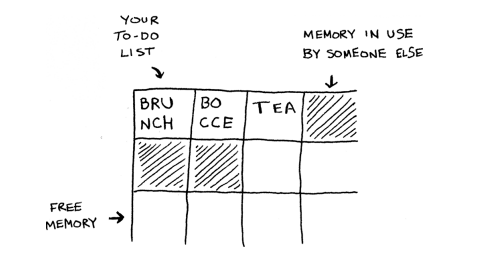
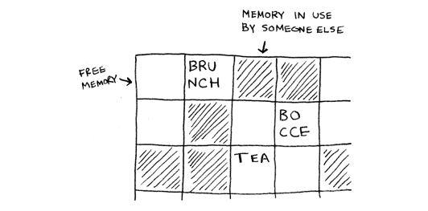
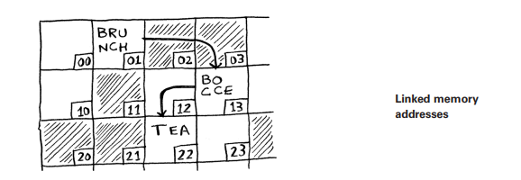
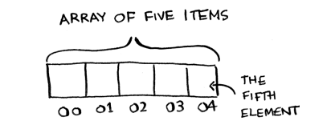
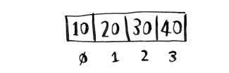
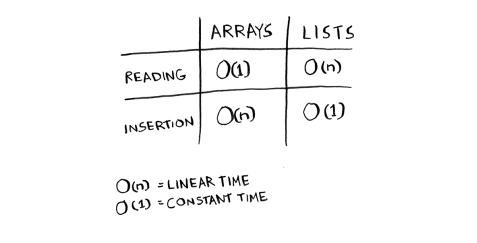
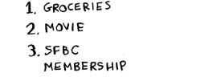

# Səyyah satıcı problemi

Siz sonuncu bölməni oxuyub "O(n!) vaxtı tələb edən bir alqoritmə heç vaxt rast gəlməyəcəyəm" deyə düşünə bilərsiniz. Yaxşı, icazə verin sizi səhv çıxarmağa çalışım! Budur həqiqətən pis icra müddətinə malik bir alqoritm nümunəsi. Bu problem kompüter elmində məşhurdur, çünki onun artımı dəhşətlidir və bəzi çox ağıllı insanlar onun təkmilləşdirilə bilməyəcəyini düşünürlər. Buna səyyah satıcı problemi deyilir.

---

## Original text (English)

# The traveling salesperson

You might have read that last section and thought, "There's no way I'll ever run into an algorithm that takes O(n!) time." Well, let me try to prove you wrong! Here's an example of an algorithm with a really bad running time. This problem is famous in computer science because its growth is appalling and some very smart people think it can't be improved. It's called the traveling salesperson problem.

# Səyyah satıcı problemi: Detallar

Sizin bir satıcınız var. Satıcı beş şəhərə getməlidir. Bu satıcı, onu Opus adlandıracağam, minimum məsafə qət edərək hər beş şəhərə çatmaq istəyir. Bunu etməyin bir yolu budur: onun şəhərlərə səyahət edə biləcəyi hər mümkün sıraya baxmaq. O, ümumi məsafəni toplayır və sonra ən qısa məsafəyə malik yolu seçir.

Beş şəhər üçün 120 permutasiya var, buna görə də beş şəhər üçün problemi həll etmək 120 əməliyyat tələb edəcək. Altı şəhər üçün 720 əməliyyat tələb edəcək (720 permutasiya var). Yeddi şəhər üçün 5,040 əməliyyat tələb edəcək!

Ümumiyyətlə, n element üçün nəticəni hesablamaq n! (n faktorial) əməliyyat tələb edəcək. Beləliklə, bu, O(n!) vaxtı, yəni faktorial vaxtdır. Ən kiçik rəqəmlər istisna olmaqla, hər şey üçün çoxlu əməliyyatlar tələb edir. 100-dən çox şəhərlə məşğul olduğunuz zaman cavabı vaxtında hesablamaq mümkün deyil - Günəş əvvəlcə çökəcək. Bu dəhşətli bir alqoritmdir! Opus başqa bir alqoritm istifadə etməlidir, düzdürmü? Amma edə bilməz. Bu, kompüter elmində həll olunmamış problemlərdən biridir. Onun üçün sürətli bir alqoritm yoxdur və bəzi ağıllı insanlar bu problem üçün ağıllı bir alqoritmin olmasının qeyri-mümkün olduğunu düşünürlər. Edə biləcəyimiz ən yaxşı şey təxmini bir həll tapmaqdır; daha ətraflı məlumat üçün 10-cu fəsilə baxın.

---

## Original text (English)

# The Traveling Salesperson Problem: Details

You have a salesperson. The salesperson has to go to five cities. This salesperson, whom I’ll call Opus, wants to hit all five cities while traveling the minimum distance. Here’s one way to do that: look at every possible order in which he could travel to the cities. He adds up the total distance and then picks the path with the lowest distance. There are 120 permutations with five cities, so it will take 120 operations to solve the problem for five cities. For six cities, it will take 720 operations (there are 720 permutations). For seven cities, it will take 5,040 operations! In general, for n items, it will take n! (n factorial) operations to compute the result. So this is O(n!) time, or factorial time. It takes a lot of operations for everything except the smallest numbers. Once you’re dealing with 100+ cities, it’s impossible to calculate the answer in time— the Sun will collapse first. This is a terrible algorithm! Opus should use a different one, right? But he can’t. This is one of the unsolved problems in computer science. There’s no fast known algorithm for it, and some smart people think it’s impossible to have a smart algorithm for this problem. The best we can do is come up with an approximate solution; see chapter 10 for more.
# Xülasə

*   Massiviniz böyüdükcə binar axtarış sadə axtarışdan xeyli sürətlidir.
*   O(log n) O(n)-dən daha sürətlidir və axtardığınız elementlər siyahısı böyüdükcə xeyli sürətlənir.
*   Alqoritmin sürəti saniyələrlə ölçülmür.
*   Alqoritmin vaxtları alqoritmin artımı baxımından ölçülür.
*   Alqoritmin vaxtları böyük O notasiyasında yazılır.

---

## Original text (English)

# Recap

*   Binary search is a lot faster than simple search as your array gets bigger.
*   O(log n) is faster than O(n), and it gets a lot faster once the list of items you’re searching through grows.
*   Algorithm speed isn’t measured in seconds.
*   Algorithm times are measured in terms of growth of an algorithm.
*   Algorithm times are written in big O notation.

# Bu fəsildə

*   Siz massivlər və bağlı siyahılar haqqında öyrənirsiniz - ən əsas məlumat strukturlarından ikisi. Onlar hər yerdə istifadə olunur. Siz artıq 1-ci fəsildə massivlərdən istifadə etmisiniz və bu kitabın demək olar ki, hər fəslində onlardan istifadə edəcəksiniz. Massivlər çox vacib bir mövzudur, ona görə diqqətli olun! Lakin bəzən massiv əvəzinə bağlı siyahıdan istifadə etmək daha yaxşıdır. Bu fəsil hər ikisinin üstünlüklərini və çatışmazlıqlarını izah edir ki, alqoritminiz üçün hansının doğru olduğuna qərar verə biləsiniz.
*   Siz ilk çeşidləmə alqoritminizi öyrənirsiniz. Bir çox alqoritm yalnız məlumatlarınız çeşidlənmiş olduqda işləyir. Binar axtarışı xatırlayırsınız? Binar axtarışı yalnız çeşidlənmiş elementlər siyahısında işlədə bilərsiniz. Bu fəsil sizə seçim çeşidləməsini öyrədir. Əksər dillərdə daxili çeşidləmə alqoritmi var, buna görə də öz versiyanızı sıfırdan yazmağınıza nadir hallarda ehtiyac olacaq. Lakin seçim çeşidləməsi quicksort-a gedən bir addımdır, hansı ki, 4-cü fəsildə əhatə edəcəyəm. Quicksort vacib bir alqoritmdir və əgər siz artıq bir çeşidləmə alqoritmi bilirsinizsə, onu başa düşmək daha asan olacaq.

---

## Original text (English)

# In this chapter

*   You learn about arrays and linked lists—two of the most basic data structures. They’re used absolutely everywhere. You already used arrays in chapter 1, and you’ll use them in almost every chapter in this book. Arrays are a crucial topic, so pay attention! But sometimes it’s better to use a linked list instead of an array. This chapter explains the pros and cons of both so you can decide which one is right for your algorithm.
*   You learn your first sorting algorithm. A lot of algorithms only work if your data is sorted. Remember binary search? You can run binary search only on a sorted list of elements. This chapter teaches you selection sort. Most languages have a sorting algorithm built in, so you’ll rarely need to write your own version from scratch. But selection sort is a stepping stone to quicksort, which I’ll cover in chapter 4. Quicksort is an important algorithm, and it will be easier to understand if you know one sorting algorithm already.

# Bilməli olduqlarınız

Bu fəsildəki performans analizi hissələrini başa düşmək üçün böyük O notasiyasını və loqarifmləri bilməlisiniz. Əgər bunları bilmirsinizsə, geri qayıdıb 1-ci fəsli oxumağınızı təklif edirəm. Böyük O notasiyası kitabın qalan hissəsində istifadə olunacaq.

---

## Original text (English)

# What you need to know

To understand the performance analysis bits in this chapter, you need to know big O notation and logarithms. If you don’t know those, I suggest you go back and read chapter 1. Big O notation will be used throughout the rest of the book.

# Yaddaş necə işləyir

Təsəvvür edin ki, bir şouya gedirsiniz və əşyalarınızı yoxlamaq lazımdır. Çekmeceli bir şkaf mövcuddur. Hər çekmece bir elementi saxlaya bilər. Siz iki əşya saxlamaq istəyirsiniz, buna görə də iki çekmece istəyirsiniz. Siz iki əşyanızı burada saxlayırsınız və şouya hazırsınız!

Bu, əsasən kompüterinizin yaddaşının necə işlədiyidir. Kompüteriniz nəhəng bir çekmece dəstinə bənzəyir və hər çekmecenin bir ünvanı var. `fe0ffeeb` yaddaşdakı bir yuvanın ünvanıdır. Hər dəfə yaddaşda bir element saxlamaq istədiyinizdə, kompüterdən bir qədər yer istəyirsiniz və o, sizə elementinizi saxlaya biləcəyiniz bir ünvan verir.

Əgər birdən çox element saxlamaq istəyirsinizsə, bunu etməyin iki əsas yolu var: massivlər və bağlı siyahılar. Mən növbəti olaraq massivlər və siyahılar, eləcə də hər birinin üstünlükləri və çatışmazlıqları haqqında danışacağam. Hər istifadə halı üçün elementləri saxlamağın tək bir doğru yolu yoxdur, buna görə də fərqləri bilmək vacibdir.

---

## Original text (English)

# How memory works

Imagine you go to a show and need to check your things. A chest of drawers is available. Each drawer can hold one element. You want to store two things, so you ask for two drawers. You store your two things here And you’re ready for the show! This is basically how your computer’s memory works. Your computer looks like a giant set of drawers, and each drawer has an address. fe0ffeeb is the address of a slot in memory. Each time you want to store an item in memory, you ask the computer for some space, and it gives you an address where you can store your item. If you want to store multiple items, there are two basic ways to do so: arrays and linked lists. I’ll talk about arrays and lists next, as well as the pros and cons of each. There isn’t one right way to store items for every use case, so it’s important to know the differences.

# Massivlər və bağlı siyahılar

Bəzən yaddaşda elementlər siyahısını saxlamaq lazım olur. Tutaq ki, siz öz tapşırıqlarınızı idarə etmək üçün bir tətbiq yazırsınız. Tapşırıqları yaddaşda siyahı kimi saxlamaq istəyəcəksiniz. Massivdən yoxsa bağlı siyahıdan istifadə etməlisiniz? Gəlin əvvəlcə tapşırıqları massivdə saxlayaq, çünki bunu başa düşmək daha asandır. Massivdən istifadə etmək o deməkdir ki, bütün tapşırıqlarınız yaddaşda ardıcıl (bir-birinin yanında) saxlanılır.

---

## Original text (English)

# Arrays and linked lists

Sometimes you need to store a list of elements in memory. Suppose you’re writing an app to manage your to-dos. You’ll want to store the to-dos as a list in memory. Should you use an array or a linked list? Let’s store the to-dos in an array first because it’s easier to grasp. Using an array means all your tasks are stored contiguously (right next to each other) in memory.

# Massivə əlavə etmə problemi

İndi, tutaq ki, dördüncü bir tapşırıq əlavə etmək istəyirsiniz. Lakin növbəti çekmece başqasının əşyaları ilə doludur!

---

## Original text (English)

# Add task to array problem

Now, suppose you want to add a fourth task. But the next drawer is taken up by someone else’s stuff!
# Massivin ölçüsünü dəyişdirmə analogiyası

Bu, dostlarınızla kinoya getməyə və oturacaq tapmağa bənzəyir - lakin başqa bir dostunuz da sizə qoşulur və onlar üçün yer yoxdur. Hamınızın yerləşə biləcəyi yeni bir yerə köçməlisiniz. Bu halda, kompüterinizdən dörd tapşırığı yerləşdirə biləcək fərqli bir yaddaş hissəsi istəməlisiniz. Sonra bütün tapşırıqlarınızı ora köçürməlisiniz.

---

## Original text (English)

# Array Resizing Analogy

It’s like going to a movie with your friends and finding a place to sit— but another friend joins you, and there’s no place for them. You have to move to a new spot where you all fit. In this case, you need to ask your computer for a different chunk of memory that can fit four tasks. Then you need to move all your tasks there.

# Massivlərin çatışmazlıqları

Əgər başqa bir dostunuz gəlsə, yenidən yeriniz olmayacaq - və hamınız ikinci dəfə köçməli olacaqsınız! Nə qədər əziyyət. Eynilə, massivə yeni elementlər əlavə etmək böyük bir əziyyət ola bilər. Əgər yeriniz yoxdursa və hər dəfə yaddaşda yeni bir yerə köçməlisinizsə, yeni bir element əlavə etmək həqiqətən yavaş olacaq.

Bir asan həll "yer saxlamaq"dır: tapşırıq siyahınızda yalnız üç elementiniz olsa belə, ehtiyat üçün kompüterdən 10 yuva istəyə bilərsiniz. Sonra köçmək məcburiyyətində qalmadan tapşırıq siyahınıza 10-a qədər element əlavə edə bilərsiniz. Bu yaxşı bir həll yoludur, lakin bir neçə çatışmazlığı nəzərə almalısınız:

*   Siz istədiyiniz əlavə yuvalara ehtiyac duymaya bilərsiniz və bu zaman həmin yaddaş israf olacaq. Siz onu istifadə etmirsiniz, lakin başqa heç kim də onu istifadə edə bilməz.
*   Tapşırıq siyahınıza 10-dan çox element əlavə edə bilərsiniz və yenə də köçmək məcburiyyətində qala bilərsiniz.

Beləliklə, bu yaxşı bir həll yoludur, lakin mükəmməl bir həll deyil. Bağlı siyahılar elementləri əlavə etmə problemini həll edir.

---

## Original text (English)

# Array Downsides

If another friend comes by, you’re out of room again—and you all have to move a second time! What a pain. Similarly, adding new items to an array can be a big pain. If you’re out of space and need to move to a new spot in memory every time, adding a new item will be really slow. One easy fix is to “hold seats”: even if you have only three items in your task list, you can ask the computer for 10 slots, just in case. Then you can add up to 10 items to your task list without having to move. This is a good workaround, but you should be aware of a couple of downsides: • You may not need the extra slots that you asked for, and then that memory will be wasted. You aren’t using it, but no one else can use it either. • You may add more than 10 items to your task list and have to move anyway. So it’s a good workaround, but it’s not a perfect solution. Linked lists solve this problem of adding items.

# Bağlı siyahılar

Bağlı siyahılarla elementləriniz yaddaşda istənilən yerdə ola bilər.

---

## Original text (English)

# Linked lists

With linked lists, your items can be anywhere in memory.

# Bağlı siyahıların strukturu

Hər bir element siyahıdakı növbəti elementin ünvanını saxlayır. Bir sıra təsadüfi yaddaş ünvanları bir-birinə bağlanır.

---

## Original text (English)

# Linked list structure

Each item stores the address of the next item in the list. A bunch of random memory addresses are linked together.

# Bağlı siyahıların üstünlükləri

Bu, xəzinə axtarışına bənzəyir. Siz ilk ünvana gedirsiniz və orada yazılıb: "Növbəti element 123 ünvanında tapıla bilər." Beləliklə, siz 123 ünvanına gedirsiniz və orada yazılıb: "Növbəti element 847 ünvanında tapıla bilər," və s.

Bağlı siyahıya element əlavə etmək asandır: onu yaddaşda istənilən yerə qoyursunuz və ünvanı əvvəlki elementlə birlikdə saxlayırsınız. Bağlı siyahılarla elementlərinizi heç vaxt köçürmək məcburiyyətində qalmırsınız. Siz həmçinin başqa bir problemdən də qaçırsınız. Tutaq ki, beş dostunuzla məşhur bir filmə gedirsiniz. Altınız oturmaq üçün yer tapmağa çalışırsınız, lakin teatr doludur. Altı yer bir yerdə yoxdur. Bəzən bu, massivlərlə baş verir. Tutaq ki, bir massiv üçün 10,000 yuva tapmağa çalışırsınız. Yaddaşınızda 10,000 yuva var, lakin 10,000 yuva bir yerdə yoxdur. Massiviniz üçün yer tapa bilmirsiniz!

Bağlı siyahı "Gəlin ayrılaq və filmə baxaq" deməyə bənzəyir. Əgər yaddaşda yer varsa, bağlı siyahınız üçün yeriniz var. Əgər bağlı siyahılar əlavə etməkdə bu qədər yaxşıdırsa, massivlər nə üçün yaxşıdır?

---

## Original text (English)

# Linked List Advantages

Each item stores the address of the next item in the list. A bunch of random memory addresses are linked together. It’s like a treasure hunt. You go to the first address, and it says, “The next item can be found at address 123.” So you go to address 123, and it says, “The next item can be found at address 847,” and so on. Adding an item to a linked list is easy: you stick it anywhere in memory and store the address with the previous item. With linked lists, you never have to move your items. You also avoid another problem. Let’s say you go to a popular movie with five of your friends. The six of you are trying to find a place to sit, but the theater is packed. There aren’t six seats together. Well, sometimes this happens with arrays. Let’s say you’re trying to find 10,000 slots for an array. Your memory has 10,000 slots, but it doesn’t have 10,000 slots together. You can’t get space for your array! A linked list is like saying, “Let’s split up and watch the movie.” If there’s space in memory, you have space for your linked list. If linked lists are so much better at inserts, what are arrays good for?
# Massivlər

Top-10 siyahıları olan veb-saytlar bəzən daha çox səhifə baxışı əldə etmək üçün bu taktikadan istifadə edirlər. Siyahını bir səhifədə göstərmək əvəzinə, hər səhifəyə bir element qoyur və siyahıdakı növbəti elementə keçmək üçün "Növbəti" düyməsini basmağınızı tələb edirlər. Məsələn, "Ən Yaxşı 10 TV Canisi" bütün siyahını bir səhifədə göstərməyəcək. Bunun əvəzinə, siz #10-dan (Newman) başlayırsınız və #1-ə (Gustavo Fring) çatmaq üçün hər səhifədə "Növbəti" düyməsini basmalısınız. Bu texnika veb-saytlara sizə reklam göstərmək üçün 10 tam səhifə verir, lakin #1-ə çatmaq üçün doqquz dəfə "Növbəti" düyməsini basmaq darıxdırıcıdır. Bütün siyahının bir səhifədə olması və daha çox məlumat üçün hər bir şəxsin adına klikləyə bilməyiniz daha yaxşı olardı.

Bağlı siyahılarda da oxşar problem var. Tutaq ki, bağlı siyahıdakı sonuncu elementi oxumaq istəyirsiniz. Siz onu sadəcə oxuya bilməzsiniz, çünki onun hansı ünvanda olduğunu bilmirsiniz. Bunun əvəzinə, #1 elementinə gedib #2 elementinin ünvanını almalısınız. Sonra #2 elementinə gedib #3 elementinin ünvanını almalısınız. Və beləcə, sonuncu elementə çatana qədər davam edir.

Bağlı siyahılar, əgər bütün elementləri bir-bir oxuyacaqsınızsa, əladır: bir elementi oxuya, ünvanı izləyərək növbəti elementə keçə bilərsiniz və s. Lakin əgər davamlı olaraq tullanacaqsınızsa, bağlı siyahılar dəhşətlidir.

Massivlər fərqlidir. Massivinizdəki hər bir elementin ünvanını bilirsiniz. Məsələn, tutaq ki, massivinizdə beş element var və onun 00 ünvanından başladığını bilirsiniz. #5 elementinin ünvanı nədir?

---

## Original text (English)

# Arrays

Websites with top-10 lists sometimes use this tactic to get more page views. Instead of showing you the list on one page, they put one item on each page and make you click Next to get to the next item in the list. For example, Top 10 Best TV Villains won’t show you the entire list on one page. Instead, you start at #10 (Newman), and you have to click Next on each page to reach #1 (Gustavo Fring). This technique gives the websites 10 whole pages on which to show you ads, but it’s boring to click Next nine times to get to #1. It would be much better if the whole list was on one page and you could click each person’s name for more info.

Linked lists have a similar problem. Suppose you want to read the last item in a linked list. You can’t just read it because you don’t know what address it’s at. Instead, you have to go to item #1 to get the address for item #2. Then you have to go to item #2 to get the address for item #3. And so on, until you get to the last item. Linked lists are great if you’re going to read all the items one at a time: you can read one item, follow the address to the next item, and so on. But if you’re going to keep jumping around, linked lists are terrible.

Arrays are different. You know the address for every item in your array. For example, suppose your array contains five items, and you know it starts at address 00. What is the address of item #5?

# Massivlər: Təsadüfi giriş

Sadə riyaziyyat sizə deyir: bu, 04-dür. Massivlər təsadüfi elementləri oxumaq istəyirsinizsə əladır, çünki massivinizdəki istənilən elementi dərhal tapa bilərsiniz. Bağlı siyahıda elementlər bir-birinin yanında deyil, buna görə də yaddaşda beşinci elementin mövqeyini dərhal hesablaya bilməzsiniz - ikinci elementin ünvanını almaq üçün birinci elementə getməlisiniz, sonra üçüncü elementin ünvanını almaq üçün ikinci elementə getməlisiniz və beləcə beşinci elementə çatana qədər davam edir.

---

## Original text (English)

# Arrays: Random Access

Simple math tells you: it’s 04. Arrays are great if you want to read random elements because you can look up any element in your array instantly. With a linked list, the elements aren’t next to each other, so you can’t instantly calculate the position of the fifth element in memory—you have to go to the first element to get the address to the second element, then go to the second element to get the address of the third element, and so on until you get to the fifth element.
# Terminologiya

Massivdəki elementlər nömrələnir. Bu nömrələmə 1-dən deyil, 0-dan başlayır. Məsələn, bu massivdə 20, 1-ci mövqedədir.

---

## Original text (English)

# Terminology

The elements in an array are numbered. This numbering starts from 0, not 1. For example, in this array, 20 is at position 1.

# Massivlərin indekslənməsi

Və 10, 0-cı mövqedədir. Bu, adətən yeni proqramçıları çaşdırır. 0-dan başlamaq hər cür massiv əsaslı kodu yazmağı asanlaşdırır, buna görə də proqramçılar buna sadiq qalıblar. İstifadə etdiyiniz demək olar ki, hər proqramlaşdırma dili massiv elementlərini 0-dan başlayaraq nömrələyəcək. Tezliklə buna öyrəşəcəksiniz.

Bir elementin mövqeyi onun indeksi adlanır. Beləliklə, "20, 1-ci mövqedədir" demək əvəzinə, düzgün terminologiya "20, 1-ci indeksdədir" deməkdir. Mən bu kitab boyu mövqe mənasında "indeks" sözünü istifadə edəcəyəm.

Budur massivlər və siyahılar üzərində ümumi əməliyyatlar üçün icra müddətləri.

---

## Original text (English)

# Array Indexing

And 10 is at position 0. This usually throws new programmers for a spin. Starting at 0 makes all kinds of array-based code easier to write, so programmers have stuck with it. Almost every programming language you use will number array elements starting at 0. You’ll soon get used to it. The position of an element is called its index. So instead of saying, “20 is at position 1,” the correct terminology is, “20 is at index 1.” I’ll use index to mean position throughout this book. Here are the run times for common operations on arrays and lists.

# Sual: Niyə massivə element daxil etmək O(n) vaxtı tələb edir?

Tutaq ki, massivin əvvəlinə bir element daxil etmək istəyirsiniz. Bunu necə edərdiniz? Nə qədər vaxt çəkərdi? Bu sualların cavablarını növbəti bölmədə tapın!

---

## Original text (English)

# Question: Why does it take O(n) time to insert an element into an array?

Suppose you wanted to insert an element at the beginning of an array. How would you do it? How long would it take? Find the answers to these questions in the next section!
# TAPŞIRIQ 2.1

Tutaq ki, maliyyənizi izləmək üçün bir tətbiq qurursunuz. Hər gün pul xərclədiyiniz hər şeyi qeyd edirsiniz. Ayın sonunda xərclərinizi nəzərdən keçirir və nə qədər xərclədiyinizi cəmləyirsiniz. Beləliklə, çoxlu əlavələr və bir neçə oxuma əməliyyatınız var. Massivdən yoxsa siyahıdan istifadə etməlisiniz?

**Cavab:** Bu ssenaridə **bağlı siyahıdan** istifadə etmək daha məqsədəuyğundur.

**İzahı:**
*   **Çoxlu əlavələr (inserts):** Bağlı siyahılar elementləri əlavə etməkdə çox səmərəlidir (O(1) vaxt). Massivlərə element əlavə etmək, xüsusilə də əvvələ və ya ortaya əlavə edildikdə, elementlərin yerini dəyişdirməyi tələb etdiyi üçün yavaş ola bilər (O(n) vaxt). Gündəlik xərcləri qeyd etmək çoxlu əlavə əməliyyat deməkdir.
*   **Bir neçə oxuma (reads):** Maliyyə xərclərini ayın sonunda nəzərdən keçirmək və cəmləmək o qədər də tez-tez baş verməyən bir əməliyyatdır. Bağlı siyahılarda təsadüfi oxuma yavaş olsa da (O(n)), bu ssenaridə oxuma əməliyyatlarının sayı az olduğu üçün bu, əlavə etmə əməliyyatlarının sürətindən daha az kritikdir.

Buna görə də, əlavə etmə əməliyyatlarının üstünlük təşkil etdiyi bu vəziyyətdə bağlı siyahı daha yaxşı performans göstərəcəkdir.

---

## Original text (English)

# EXERCISE 2.1

Suppose you’re building an app to keep track of your finances. Every day, you write down everything you spent money on. At the end of the month, you review your expenses and sum up how much you spent. So you have lots of inserts and a few reads. Should you use an array or a list?

