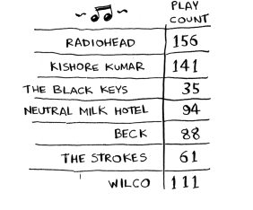
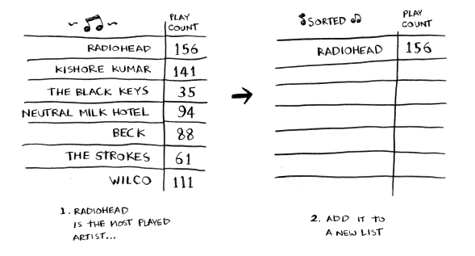
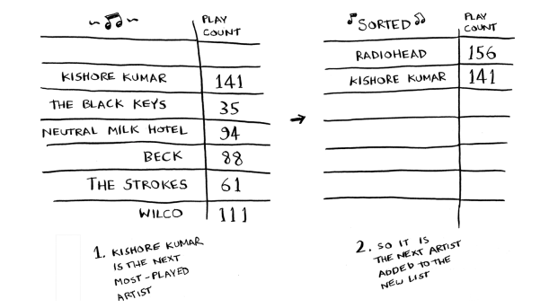
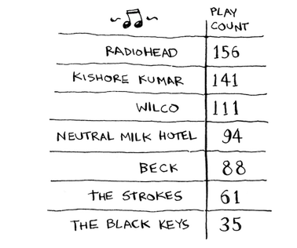
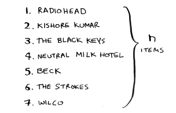
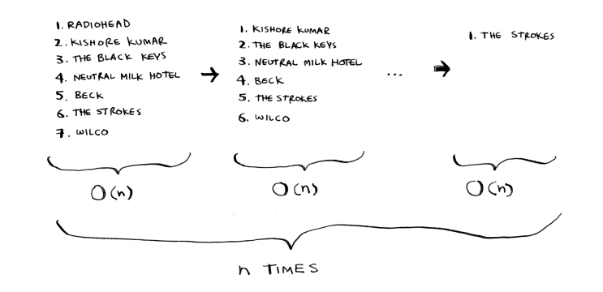
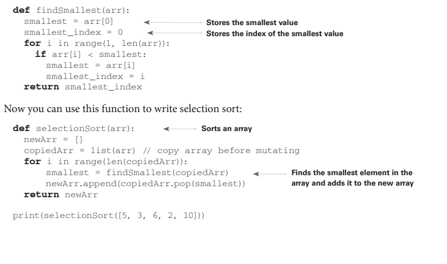

# Seçim çeşidləməsi

Gəlin ikinci alqoritmimizi öyrənmək üçün hər şeyi bir araya gətirək: seçim çeşidləməsi. Bu bölməni başa düşmək üçün massivləri və böyük O notasiyasını bilməlisiniz. Tutaq ki, kompüterinizdə çoxlu musiqi var. Hər bir ifaçı üçün bir dinləmə sayınız var.

---

## Original text (English)

# Selection sort

Let’s put it all together to learn your second algorithm: selection sort. To follow this section, you need to understand arrays and big O notation. Suppose you have a bunch of music on your computer. For each artist, you have a play count.
\`\`\`


# Seçim çeşidləməsi: Addım 1

Siz bu ifaçıları ən çox dinləniləndən ən az dinlənilənə doğru sıralamaq istəyirsiniz ki, sevimli ifaçılarınızı sıralaya biləsiniz. Bunu necə edə bilərsiniz? Bir yolu siyahıdan keçib ən çox dinlənilən ifaçını tapmaqdır. Həmin ifaçını yeni bir siyahıya əlavə edin.

---

## Original text (English)

# Selection Sort: Step 1

You want to sort these artists from most to least played so that you can rank your favorite artists. How can you do it? One way is to go through the list and find the most-played artist. Add that artist to a new list.

# Seçim çeşidləməsi: Addım 2

Növbəti ən çox dinlənilən ifaçını tapmaq üçün yenidən edin.

---

## Original text (English)

# Selection Sort: Step 2

Do it again to find the next-most-played artist.


# Seçim çeşidləməsi: Addım 3

Bunu davam etdirin və çeşidlənmiş bir siyahı əldə edəcəksiniz.

---

## Original text (English)

# Selection Sort: Step 3

Keep doing this, and you’ll end up with a sorted list.

# Seçim çeşidləməsi: Analizə giriş

Gəlin kompüter elmi papaqlarımızı taxaq və bunun nə qədər vaxt aparacağını görək. Unutmayın ki, O(n) vaxtı siyahıdakı hər bir elementə bir dəfə toxunmaq deməkdir. Məsələn, ifaçılar siyahısı üzərində sadə axtarış aparmaq hər bir ifaçıya bir dəfə baxmaq deməkdir.

---

## Original text (English)

# Selection Sort: Analysis Intro

Let’s put on our computer science hats and see how long this will take to run. Remember that O(n) time means you touch every element in a list once. For example, running a simple search over the list of artists means looking at each artist once.


# Seçim çeşidləməsi: Mürəkkəblik (Hissə 1)

Ən yüksək dinləmə sayına malik ifaçını tapmaq üçün siyahıdakı hər bir elementi yoxlamalısınız. Bu, indicə gördüyünüz kimi, O(n) vaxtı tələb edir. Beləliklə, sizdə O(n) vaxtı tələb edən bir əməliyyat var və bunu n dəfə etməlisiniz.

---

## Original text (English)

# Selection Sort: Complexity Part 1

To find the artist with the highest play count, you have to check each item in the list. This takes O(n) time, as you just saw. So you have an operation that takes O(n) time, and you have to do that n times.

# Seçim çeşidləməsi: Mürəkkəblik (Hissə 2)

Bu, O(n × n) vaxtı və ya O(n²) vaxtı tələb edir. Çeşidləmə alqoritmləri çox faydalıdır. İndi siz çeşidləyə bilərsiniz:

*   Telefon kitabındakı adları
*   Səyahət tarixlərini
*   E-poçtları (ən yenidən ən köhnəyə)

---

## Original text (English)

# Selection Sort: Complexity Part 2

This takes O(n × n) time or O(n2 ) time. Sorting algorithms are very useful. Now you can sort • Names in a phone book • Travel dates • Emails (newest to oldest)

# Hər dəfə daha az element yoxlamaq

Əməliyyatlardan keçdikcə, yoxlamalı olduğunuz elementlərin sayı azalmağa davam edir. Nəhayət, yalnız bir elementi yoxlamağa qədər gəlirsiniz. Beləliklə, bəlkə də düşünürsünüz: İcra müddəti necə hələ də O(n²) ola bilər? Bu yaxşı bir sualdır və cavab böyük O notasiyasındakı sabitlərlə əlaqədardır. Mən bunu 4-cü fəsildə daha ətraflı izah edəcəyəm, lakin əsas fikir budur.

Siz haqlısınız ki, hər dəfə n elementdən ibarət siyahını yoxlamaq lazım deyil. Siz n elementi, sonra n – 1, n – 2, . . . 2, 1 elementi yoxlayırsınız. Orta hesabla, siz 1/2 × n elementdən ibarət siyahını yoxlayırsınız. İcra müddəti O(n × 1/2 × n)-dir. Lakin 1/2 kimi sabitlər böyük O notasiyasında nəzərə alınmır (yenə də tam müzakirə üçün 4-cü fəsilə baxın), buna görə də sadəcə O(n × n) və ya O(n²) yazırsınız.

---

## Original text (English)

# Selection Sort: Constant

Checking fewer elements each time As you go through the operations, the number of elements you have to check keeps decreasing. Eventually, you’re down to having to check just one element. So maybe you are wondering: How can the run time still be O(n2 )? That’s a good question, and the answer has to do with constants in big O notation. I’ll get into this more in chapter 4, but here’s the gist. You’re right that you don’t have to check a list of n elements each time. You check n elements, then n – 1, n – 2, . . . 2, 1. On average, you check a list that has 1/2 × n elements. The runtime is O(n × 1/2 × n). But constants like 1/2 are ignored in big O notation (again, see chapter 4 for the full discussion), so you just write O(n × n) or O(n2 ).
# Seçim çeşidləməsi: Nəticə

Seçim çeşidləməsi səliqəli bir alqoritmdir, lakin çox sürətli deyil. Quicksort daha sürətli bir çeşidləmə alqoritmidir və yalnız O(n log n) vaxtı tələb edir. Bu, 4-cü fəsildə gələcək!

---

## Original text (English)

# Selection Sort: Conclusion

Selection sort is a neat algorithm, but it’s not very fast. Quicksort is a faster sorting algorithm that only takes O(n log n) time. It’s coming up in chapter 4!

# Nümunə kod siyahısı

Mən sizə musiqi siyahısını çeşidləmək üçün kodu göstərmədim, lakin aşağıdakı kod çox oxşar bir iş görəcək: bir massivi ən kiçikdən ən böyüyə doğru çeşidləmək. Gəlin bir massivdə ən kiçik elementi tapan bir funksiya yazaq:

---

## Original text (English)

# Example Code Listing

I didn’t show you the code to sort the music list, but the following is some code that will do something very similar: sort an array from smallest to largest. Let’s write a function to find the smallest element in an array:


```js
function findSmallest(arr) {
  let smallest = arr[0];
  let smallestIndex = 0;

  for (let i = 1; i < arr.length; i++) {
    if (arr[i] < smallest) {
      smallest = arr[i];
      smallestIndex = i;
    }
  }

  return smallestIndex;
}

function selectionSort(arr) {
  const newArr = [];
  const copiedArr = [...arr]; // massiv surətlənir (mutasiya olunmasın deyə)

  for (let i = 0; i < arr.length; i++) {
    const smallestIndex = findSmallest(copiedArr);
    newArr.push(copiedArr.splice(smallestIndex, 1)[0]);
  }

  return newArr;
}

console.log(selectionSort([5, 3, 6, 2, 10])); // [2, 3, 5, 6, 10]

```

```js
function selectionSort(arr) {
  for (let i = 0; i < arr.length; i++) {
    let minIndex = i;

    for (let j = i + 1; j < arr.length; j++) {
      if (arr[j] < arr[minIndex]) {
        minIndex = j;
      }
    }

    // Dəyişdirmək (swap)
    [arr[i], arr[minIndex]] = [arr[minIndex], arr[i]];
  }

  return arr;
}

console.log(selectionSort([5, 2, 4, 1, 3])); // [1, 2, 3, 4, 5]
```

# Xülasə

*   Kompüterinizin yaddaşı nəhəng bir çekmece dəstinə bənzəyir.
*   Birdən çox element saxlamaq istədiyiniz zaman massivdən və ya bağlı siyahıdan istifadə edin.
*   Massivdə bütün elementləriniz bir-birinin yanında saxlanılır.
*   Bağlı siyahıda elementlər hər yerə səpələnmişdir və bir element növbəti elementin ünvanını saxlayır.
*   Massivlər sürətli oxumağa imkan verir.
*   Bağlı siyahılar sürətli daxil etmə və silməyə imkan verir.

---

## Original text (English)

# Recap

*   Your computer’s memory is like a giant set of drawers.
*   When you want to store multiple elements, use an array or a linked list.
*   With an array, all your elements are stored right next to each other.
*   With a linked list, elements are strewn all over, and one element stores the address of the next one.
*   Arrays allow fast reads.
*   Linked lists allow fast inserts and deletes.


