# Bu fəsildə

*   Siz rekursiya haqqında öyrənirsiniz. Rekursiya bir çox alqoritmdə istifadə olunan kodlaşdırma texnikasıdır. Bu, kitabın sonrakı fəsillərini başa düşmək üçün bir tikinti blokudur.
*   Siz əsas hal və rekursiv halın nə olduğunu öyrənirsiniz. "Böl və hökm et" strategiyası (4-cü fəsil) çətin problemləri həll etmək üçün bu sadə konsepsiyadan istifadə edir.

---

## Original text (English)

# In this chapter

*   You learn about recursion. Recursion is a coding technique used in many algorithms. It's a building block for understanding later chapters in this book.
*   You learn what a base case and a recursive case is. The divide-and-conquer strategy (chapter 4) uses this simple concept to solve hard problems.

# Rekursiya fəsli: Məsləhətlər

Bu fəsildən həyəcanlanıram, çünki o, problemləri həll etməyin zərif bir yolu olan rekursiyanı əhatə edir. Rekursiya mənim sevimli mövzularımdan biridir, lakin o, mübahisəlidir. İnsanlar ya onu sevirlər, ya da nifrət edirlər - və ya bir neçə il sonra sevməyi öyrənənə qədər ondan nifrət edirlər. Şəxsən mən üçüncü kateqoriyada idim.

İşlərinizi asanlaşdırmaq üçün bəzi məsləhətlərim var:

*   Bu fəsildə çoxlu kod nümunələri var. Kodun necə işlədiyini görmək üçün onu özünüz işə salın.
*   Mən rekursiv funksiyalar haqqında danışacağam. Ən azı bir dəfə qələm və kağızla rekursiv funksiyanı addım-addım keçin: "Gəlin görək, mən 5-i faktoriala ötürürəm və sonra beş dəfə 4-ü faktoriala ötürməyi qaytarıram, bu da..." və s. Bu cür funksiyanı keçmək sizə rekursiv funksiyanın necə işlədiyini öyrədəcək.

---

## Original text (English)

# Recursion Chapter: Advice

I'm excited about this chapter because it covers recursion, an elegant way to solve problems. Recursion is one of my favorite topics, but it's divisive. People either love it or hate it—or hate it until they learn to love it a few years later. I personally was in that third camp. To make things easier for you, I have some advice: • This chapter has a lot of code examples. Run the code for yourself to see how it works. • I'll talk about recursive functions. At least once, step through a recursive function with pen and paper: something like, "Let's see, I pass 5 into factorial, and then I return five times passing 4 into factorial, which is . . . ," and so on. Walking through a function like this will teach you how a recursive function works.
# Psevdokod izahı

Bu fəsil həmçinin çoxlu psevdokod ehtiva edir. Psevdokod həll etməyə çalışdığınız problemin kod şəklində yüksək səviyyəli təsviridir. O, kod kimi yazılır, lakin insan nitqinə daha yaxın olmaq üçün nəzərdə tutulub.

---

## Original text (English)

# Pseudocode Explanation

This chapter also includes a lot of pseudocode. Pseudocode is a highlevel description in code of the problem you're trying to solve. It's written like code, but it's meant to be closer to human speech.
# Rekursiya

Tutaq ki, nənənizin çardağını qazırsınız və sirli bir kilidli çamadanla rastlaşırsınız.

---

## Original text (English)

# Recursion

Suppose you're digging through your grandma's attic and come across a mysterious locked suitcase.
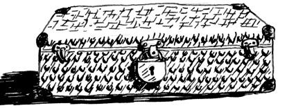

# Rekursiya: Çamadan açarı

Nənə sizə deyir ki, çamadanın açarı çox güman ki, bu digər qutudadır.

---

## Original text (English)

# Recursion: Suitcase Key

Grandma tells you that the key for the suitcase is probably in this other box

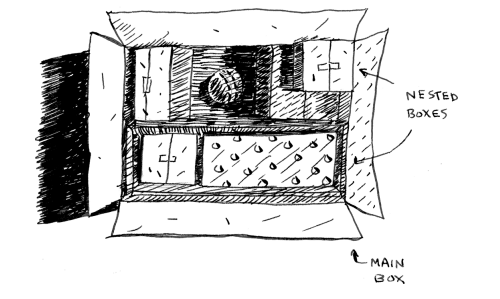
# Rekursiya: İç-içə qutular

Bu qutuda daha çox qutular var, həmin qutuların içində də daha çox qutular var. Açar haradasa bir qutudadır. Açarı axtarmaq üçün alqoritminiz nədir? Oxumağa davam etməzdən əvvəl bir alqoritm düşünün.

---

## Original text (English)

# Recursion: Nested Boxes

This box contains more boxes, with more boxes inside those boxes. The key is in a box somewhere. What's your algorithm to search for the key? Think of an algorithm before you read on.
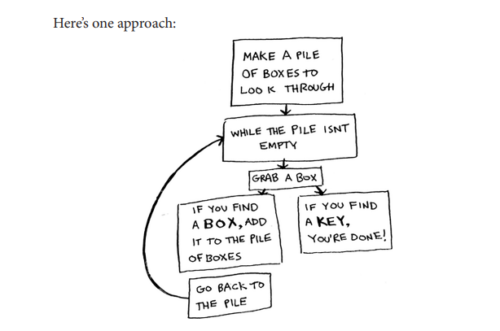

# Rekursiya: İterativ yanaşma

1. Baxılacaq qutuların yığınını düzəldin.
2. Bir qutu götürün və içinə baxın.
3. Əgər qutu tapsanız, onu sonra baxmaq üçün yığına əlavə edin.
4. Əgər açar tapsanız, işiniz bitdi!
5. Təkrarlayın.

Budur alternativ yanaşma:

---

## Original text (English)

# Recursion: Iterative Approach

1. Make a pile of boxes to look through.
2. Grab a box and look through it.
3. If you find a box, add it to the pile to look through later.
4. If you find a key, you're done!
5. Repeat.

Here's an alternate approach:

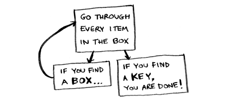
# Rekursiya: Rekursiv yanaşma

1. Qutunun içinə baxın.
2. Əgər qutu tapsanız, 1-ci addıma keçin.
3. Əgər açar tapsanız, işiniz bitdi!

---

## Original text (English)

# Recursion: Recursive Approach

1. Look through the box.
2. If you find a box, go to step 1.
3. If you find a key, you’re done!

# Rekursiya: While dövrəsi psevdokodu

Hansı yanaşma sizə daha asan görünür? Birinci yanaşma `while` dövrəsindən istifadə edir. Yığın boş olmayana qədər bir qutu götürün və içinə baxın. Budur bəzi psevdokod:

---

## Original text (English)

# Recursion: While Loop Pseudocode

Which approach seems easier to you? The first approach uses a while loop. While the pile isn’t empty, grab a box and look through it. Here’s some pseudocode:

```python
def look_for_key(main_box):
 pile = main_box.make_a_pile_to_look_through()
 while pile is not empty:
 box = pile.grab_a_box()
 for item in box:
 if item.is_a_box():
 pile.append(item)
 elif item.is_a_key():
 print("found the key!")
```

```js
function lookForKey(mainBox) {
  const pile = mainBox.makeAPileToLookThrough();

  while (pile.length > 0) {
    const box = pile.pop();

    for (const item of box) {
      if (item.isABox()) {
        pile.push(item);
      } else if (item.isAKey()) {
        console.log("found the key!");
      }
    }
  }
}

```

# Rekursiya: Funksiya psevdokodu

İkinci yol rekursiyadan istifadə edir. Rekursiya, bir funksiyanın özünü çağırmasıdır. Budur psevdokodda ikinci yol:

---

## Original text (English)

# Recursion: Function Pseudocode

The second way uses recursion. Recursion is where a function calls itself. Here’s the second way in pseudocode:

```py
def look_for_key(box):
 for item in box:
 if item.is_a_box():
 look_for_key(item) Recursion!
 elif item.is_a_key():
 print("found the key!")
```

```js
function lookForKey(box) {
  for (const item of box) {
    if (item.isABox()) {
      lookForKey(item); // Recursion!
    } else if (item.isAKey()) {
      console.log("found the key!");
    }
  }
}
```
# Rekursiya və dövrələr

Hər iki yanaşma eyni şeyi yerinə yetirir, lakin ikinci yanaşma mənə daha aydın görünür. Rekursiya həll yolunu daha aydın etdiyi zaman istifadə olunur. Rekursiyadan istifadə etməyin performans üstünlüyü yoxdur; əslində, dövrələr bəzən performans üçün daha yaxşıdır. Leigh Caldwell-in Stack Overflow-dakı bu sitatını bəyənirəm: "Dövrələr proqramınız üçün performans qazancı əldə edə bilər. Rekursiya proqramçınız üçün performans qazancı əldə edə bilər. Vəziyyətinizdə hansının daha vacib olduğunu seçin!" (http://stackoverflow.com/a/72694/139117). Bir çox vacib alqoritm rekursiyadan istifadə edir, buna görə də bu konsepsiyanı başa düşmək vacibdir.

---

## Original text (English)

# Recursion vs. Loops

Both approaches accomplish the same thing, but the second approach is clearer to me. Recursion is used when it makes the solution clearer. There’s no performance benefit to using recursion; in fact, loops are sometimes better for performance. I like this quote by Leigh Caldwell on Stack Overflow: “Loops may achieve a performance gain for your program. Recursion may achieve a performance gain for your programmer. Choose which is more important in your situation!” (http://stackoverflow.com/a/72694/139117). Many important algorithms use recursion, so it’s important to understand the concept.

# Əsas hal və rekursiv hal

Rekursiv funksiya özünü çağırdığı üçün, sonsuz dövrəyə düşən səhv bir funksiya yazmaq asandır. Məsələn, belə bir geri sayım çap edən bir funksiya yazmaq istədiyinizi fərz edin:

---

## Original text (English)

# Base Case and Recursive Case Intro

Because a recursive function calls itself, it’s easy to write a function incorrectly that ends up in an infinite loop. For example, suppose you want to write a function that prints a countdown like this:
> 3...2...1


You can write it recursively like so:
```py
def countdown(i):
 print(i)
 countdown(i-1)
 countdown(3)
```

```js
function countdown(i) {
  if (i <= 0) return;
  console.log(i);
  countdown(i - 1);
}

countdown(3);
```

# Sonsuz rekursiya problemi

Bu kodu yazın və işə salın. Bir problem görəcəksiniz: bu funksiya sonsuza qədər işləyəcək!

---

## Original text (English)

# Infinite Recursion Problem

Write out this code and run it. You’ll notice a problem: this function will run forever!


> 3...2...1...0...-1...-2...

# Əsas hal və rekursiv halın izahı

(Skriptinizi dayandırmaq üçün Ctrl-C düyməsini basın.) Rekursiv funksiya yazarkən, ona nə vaxt rekursiyanı dayandıracağını bildirməlisiniz. Buna görə də hər rekursiv funksiyanın iki hissəsi var: əsas hal və rekursiv hal. Rekursiv hal funksiyanın özünü çağırdığı haldır. Əsas hal isə funksiyanın özünü yenidən çağırmadığı haldır, beləliklə sonsuz dövrəyə düşmür. Gəlin geri sayım funksiyasına bir əsas hal əlavə edək:

---

## Original text (English)

# Base and Recursive Case Explanation

(Press Ctrl-C to kill your script.) When you write a recursive function, you have to tell it when to stop recursing. That’s why every recursive function has two parts: the base case and the recursive case. The recursive case is when the function calls itself. The base case is when the function doesn’t call itself again, so it doesn’t go into an infinite loop. Let’s add a base case to the countdown function:
```py
def countdown(i):
 if i <= 0: # base case
 print(0)
 return
 else: # recursive case
 print(i)
 countdown(i-1)
```

```js
function countdown(i) {
  if (i <= 0) return; // base case
  console.log(i);
  countdown(i - 1); // recursive case
}

countdown(3);
```
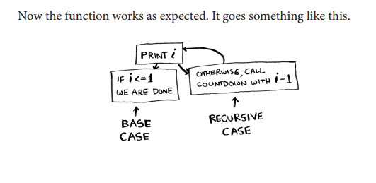

# Yığın (Stack)

Bu bölmə çağırış yığınını (call stack) əhatə edir. Çağırış yığını ümumi proqramlaşdırmada vacib bir konsepsiyadır və rekursiyadan istifadə edərkən də başa düşmək vacibdir.

Tutaq ki, siz barbekü təşkil edirsiniz. Barbekü üçün yapışqan qeydlər yığını şəklində bir tapşırıq siyahısı saxlayırsınız. Massivlər və siyahılar haqqında danışdığımız vaxtı xatırlayırsınız, və sizin bir tapşırıq siyahınız var idi? Siz tapşırıqları siyahıya istənilən yerə əlavə edə və ya təsadüfi elementləri silə bilərdiniz. Yapışqan qeydlər yığını daha sadədir. Bir elementi daxil etdiyiniz zaman, o, siyahının ən üstünə əlavə olunur. Bir elementi oxuduğunuz zaman, yalnız ən üst elementi oxuyursunuz və o, siyahıdan çıxarılır. Beləliklə, tapşırıq siyahınızda yalnız iki əməliyyat var: `push` (daxil etmə) və `pop`.

---

## Original text (English)

# The Stack

This section covers the call stack. The call stack is an important concept in general programming, and it’s also important to understand when using recursion. Suppose you’re throwing a barbecue. You keep a to-do list for the barbecue, in the form of a stack of sticky notes. Remember back when we talked about arrays and lists, and you had a to-do list? You could add to-do items anywhere to the list or delete random items. The stack of sticky notes is much simpler. When you insert an item, it gets added to the top of the list. When you read an item, you only read the topmost item, and it’s taken off the list. So your to-do list has only two actions: push (insert) and pop

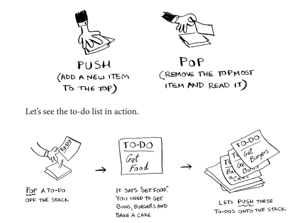

# Yığın (Stack) tərifi

Bu məlumat strukturu yığın (stack) adlanır. Yığın sadə bir məlumat strukturudur. Siz bütün bu müddət ərzində fərqinə varmadan bir yığından istifadə etmisiniz!

---

## Original text (English)

# Stack Definition

This data structure is called a stack. You’ve been using a stack this whole time without realizing it!

# Çağırış yığını (Call Stack)

Kompüteriniz daxilən çağırış yığını adlanan bir yığından istifadə edir. Gəlin onu işdə görək. Budur sadə bir funksiya:

---

## Original text (English)

# Call Stack Intro

Your computer uses a stack internally called the call stack. Let’s see it in action. Here’s a simple function:

```py
def greet(name):
 print("hello, " + name + "!")
 greet2(name)
 print("getting ready to say bye...")
 bye()
```

```js
function greet(name) {
  console.log("hello, " + name + "!");
  greet2(name);
  console.log("getting ready to say bye...");
  bye();
}
```

# Çağırış yığını funksiyaları

Bu funksiya sizi salamlayır və sonra iki başqa funksiyanı çağırır. Budur həmin iki funksiya:

---

## Original text (English)

# Call Stack Functions

This function greets you and then calls two other functions. Here are those two functions:


```py
def greet2(name):
 print("how are you, " + name + "?")
def bye():
 print("ok bye! ")
```

```js
function greet2(name) {
  console.log("how are you, " + name + "?");
}

function bye() {
  console.log("ok bye!");
}
```

# Çağırış yığını: Addım-addım izahata giriş

Gəlin bir funksiyanı çağırdığınız zaman nə baş verdiyini addım-addım nəzərdən keçirək.

---

## Original text (English)

# Call Stack Walkthrough Intro

Let’s walk through what happens when you call a function.

# Qeyd

İşləri sadə saxlamaq üçün mən yalnız `greet`, `greet2` və `bye` funksiyalarına edilən çağırışları göstərirəm. `print` funksiyasına edilən çağırışları göstərmirəm.

---

## Original text (English)

# Call Stack Walkthrough Note

To keep things simple, I’m only showing the calls to greet, greet2, and bye. I’m not showing the calls to the print function.

# Çağırış yığını: Addım 1

Tutaq ki, `greet("maggie")` funksiyasını çağırırsınız. Əvvəlcə, kompüteriniz həmin funksiya çağırışı üçün bir yaddaş qutusu ayırır.

---

## Original text (English)

# Call Stack: Step 1

Suppose you call greet("maggie"). First, your computer allocates a box of memory for that function call.

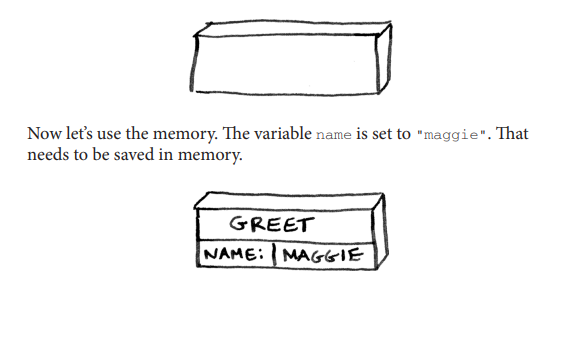

# Çağırış yığını: Addım 2

Hər dəfə bir funksiya çağırdığınız zaman, kompüteriniz həmin çağırış üçün bütün dəyişənlərin dəyərlərini yaddaşda bu şəkildə saxlayır. Sonra, "salam, maggie!" çap edirsiniz. Daha sonra `greet2("maggie")` funksiyasını çağırırsınız. Yenə də, kompüteriniz bu funksiya çağırışı üçün bir yaddaş qutusu ayırır.

---

## Original text (English)

# Call Stack: Step 2

Every time you make a function call, your computer saves the values for all the variables for that call in memory like this. Next, you print hello, maggie! Then you call greet2("maggie"). Again, your computer allocates a box of memory for this function call.
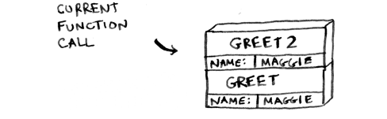
# Çağırış yığını: Addım 3

Kompüteriniz bu qutular üçün bir yığın (stack) istifadə edir. İkinci qutu birincinin üstünə əlavə olunur. "Necəsən, maggie?" çap edirsiniz. Sonra funksiya çağırışından qayıdırsınız. Bu baş verdikdə, yığının üstündəki qutu çıxarılır (`pop`).

---

## Original text (English)

# Call Stack: Step 3

Your computer is using a stack for these boxes. The second box is added on top of the first one. You print how are you, maggie? Then you return from the function call. When this happens, the box on top of the stack gets popped off.
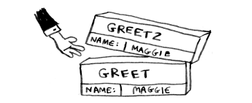
# Çağırış yığını: Addım 4

İndi yığının ən üstündəki qutu `greet` funksiyası üçündür, bu da `greet` funksiyasına qayıtdığınız deməkdir. `greet2` funksiyasını çağırdığınız zaman, `greet` funksiyası qismən tamamlanmış vəziyyətdə idi. Bu bölmənin əsas ideyası budur: bir funksiyadan başqa bir funksiyanı çağırdığınız zaman, çağıran funksiya qismən tamamlanmış vəziyyətdə dayandırılır. Həmin funksiya üçün bütün dəyişənlərin dəyərləri hələ də çağırış yığınında (yəni yaddaşda) saxlanılır. İndi `greet2` funksiyasını bitirdiyiniz üçün `greet` funksiyasına qayıdırsınız və qaldığınız yerdən davam edirsiniz. Əvvəlcə "sağollaşmağa hazırlaşıram..." çap edirsiniz. Sonra `bye` funksiyasını çağırırsınız.

---

## Original text (English)

# Call Stack: Step 4

Now the topmost box on the stack is for the greet function, which means you returned to the greet function. When you called the greet2 function, the greet function was partially completed. This is the big idea behind this section: when you call a function from another function, the calling function is paused in a partially completed state. All the values of the variables for that function are still stored on the call stack (i.e., in memory). Now that you’re done with the greet2 function, you’re back to the greet function, and you pick up where you left off. First, you print getting ready to say bye... Then you call the bye function.
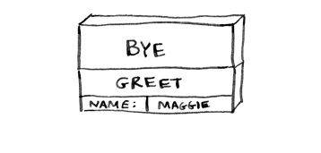

# Çağırış yığını: Addım 5

Həmin funksiya üçün bir qutu yığının üstünə əlavə olunur. Sonra "ok bye!" çap edirsiniz və funksiya çağırışından qayıdırsınız.

---

## Original text (English)

# Call Stack: Step 5

A box for that function is added to the top of the stack. Then you print ok bye! and return from the function call.
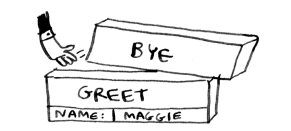

# Çağırış yığını: Nəticə

Və siz `greet` funksiyasına qayıdırsınız. Ediləcək başqa heç nə yoxdur, buna görə də `greet` funksiyasından da qayıdırsınız. Bir neçə funksiya üçün dəyişənləri saxlamaq üçün istifadə olunan bu yığın, **çağırış yığını** adlanır.

---

## Original text (English)

# Call Stack: Conclusion

And you’re back to the greet function. There’s nothing else to be done, so you return from the greet function, too. This stack, used to save the variables for multiple functions, is called the call stack.

# TAPŞIRIQLAR

Tutaq ki, sizə belə bir çağırış yığını göstərirəm.
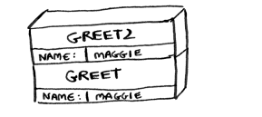

**Cavab:**

Bu çağırış yığınına əsaslanaraq aşağıdakı məlumatları verə bilərik:

1. **`greet` funksiyası çağırılıb:** Yığının ən altında `greet` funksiyası var, bu da onun ilk çağırılan funksiya olduğunu göstərir.
2. **`greet` funksiyasına ötürülən arqument:** `greet` funksiyasına `name: MAGGIE` arqumenti ötürülüb.
3. **`greet2` funksiyası `greet` funksiyasından çağırılıb:** `greet2` funksiyası `greet` funksiyasının üstündə yerləşir, bu da `greet` funksiyasının icrası zamanı `greet2` funksiyasının çağırıldığını göstərir.
4. **`greet2` funksiyasına ötürülən arqument:** `greet2` funksiyasına da `name: MAGGIE` arqumenti ötürülüb.
5. **Hazırkı icra vəziyyəti:** `greet2` funksiyası yığının ən üstündə olduğu üçün, hazırda bu funksiya icra olunur və ya icrasını yenicə tamamlayıb və geri qayıtmaq üzrədir. `greet` funksiyası isə `greet2` funksiyasının tamamlanmasını gözləyən dayandırılmış vəziyyətdədir.
# Rekursiya ilə çağırış yığını

Rekursiv funksiyalar da çağırış yığınından istifadə edir! Gəlin bunu faktorial funksiyası ilə işdə görək. `factorial(5)` 5! kimi yazılır və belə təyin olunur: 5! = 5 \* 4 \* 3 \* 2 \* 1. Eynilə, `factorial(3)` 3 \* 2 \* 1-dir. Budur bir rəqəmin faktorialını hesablamaq üçün rekursiv funksiya:

---

## Original text (English)

# The call stack with recursion

Recursive functions use the call stack, too! Let’s look at this in action with the factorial function. factorial(5) is written as 5!, and it’s defined like this: 5! = 5 * 4 * 3 * 2 * 1. Similarly, factorial(3) is 3 * 2 * 1. Here’s a recursive function to calculate the factorial of a number:

```py
def fact(x):
 if x == 1:
 return 1
 else:
 return x * fact(x-1)
```
```js
function fact(x) {
  if (x === 1) return 1;
  return x * fact(x - 1);
}
```
# Rekursiv çağırış yığını: Addım-addım izahata giriş

İndi `fact(3)` funksiyasını çağıra bilərsiniz. Gəlin bu çağırışı sətir-sətir keçək və yığının necə dəyişdiyini görək. Unutmayın, yığının ən üstündəki qutu sizə hazırda hansı `fact` çağırışında olduğunuzu göstərir.

---

## Original text (English)

# Recursive Call Stack Walkthrough Intro

Now you can call fact(3). Let’s step through this call line by line and see how the stack changes. Remember, the topmost box in the stack tells you what call to fact you’re currently on

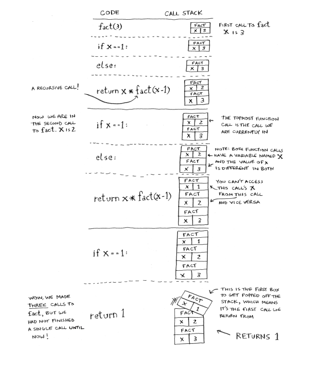
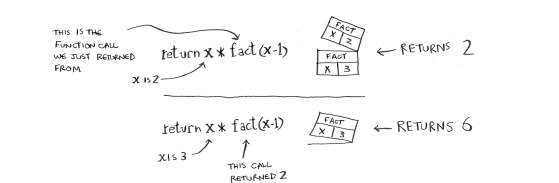

# Rekursiv çağırış yığını: x-in surəti

Diqqət edin ki, `fact` funksiyasına hər bir çağırışın öz `x` surəti var. Siz başqa bir funksiyanın `x` surətinə daxil ola bilməzsiniz. Yığın rekursiyada böyük rol oynayır. Açarı tapmaq üçün açılış nümunəsində iki yanaşma var idi. Budur yenidən birinci yol.

---

## Original text (English)

# Recursive Call Stack: Copy of x

Notice that each call to fact has its own copy of x. You can’t access a different function’s copy of x. The stack plays a big part in recursion. In the opening example, there were two approaches to finding the key. Here’s the first way again.
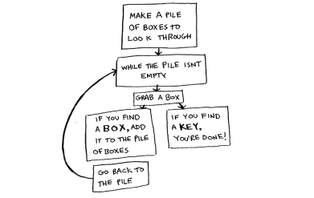
# İterativ axtarış: Yığın

Bu yolla, axtarış etmək üçün bir qutu yığını düzəldirsiniz, beləliklə, hələ də hansı qutuları axtarmalı olduğunuzu həmişə bilirsiniz.

---

## Original text (English)

# Iterative Search: Pile

This way, you make a pile of boxes to search through, so you always know what boxes you still need to search.
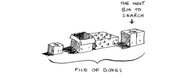

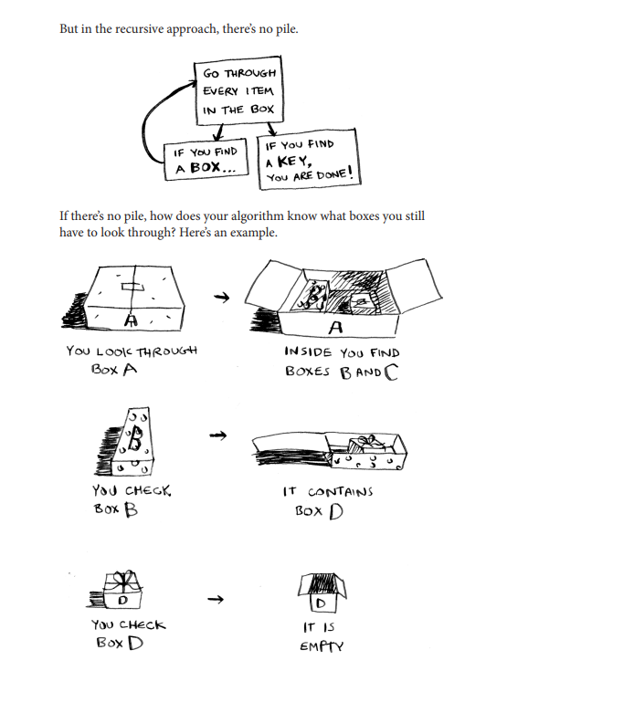
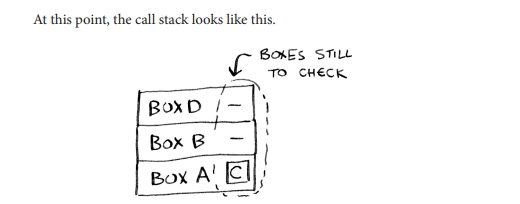
# Yığın: Yaddaş xərci

"Qutular yığını" yığında saxlanılır! Bu, yarımçıq funksiya çağırışlarının yığınıdır, hər birinin öz yarımçıq baxılacaq qutular siyahısı var. Yığından istifadə etmək rahatdır, çünki qutular yığınını özünüz izləmək məcburiyyətində qalmırsınız - yığın bunu sizin üçün edir.

Yığından istifadə etmək rahatdır, lakin bunun bir qiyməti var: bütün bu məlumatları saxlamaq çox yaddaş tuta bilər. Həmin funksiya çağırışlarının hər biri bir qədər yaddaş tutur və yığınınız çox hündür olduqda, bu o deməkdir ki, kompüteriniz bir çox funksiya çağırışı üçün məlumatları saxlayır. Bu nöqtədə iki seçiminiz var:

*   Kodunuzu dövrədən istifadə etmək üçün yenidən yaza bilərsiniz.
*   Quyruq rekursiyası adlanan bir şeydən istifadə edə bilərsiniz. Bu, bu kitabın əhatə dairəsindən kənarda olan qabaqcıl bir rekursiya mövzusudur. O, həmçinin yalnız bəzi dillər tərəfindən dəstəklənir, hamısı tərəfindən deyil.

---

## Original text (English)

# Stack Memory Cost

The “pile of boxes” is saved on the stack! This is a stack of halfcompleted function calls, each with its own half-complete list of boxes to look through. Using the stack is convenient because you don’t have to keep track of a pile of boxes yourself—the stack does it for you. Using the stack is convenient, but there’s a cost: saving all that info can take up a lot of memory. Each of those function calls takes up some memory, and when your stack is too tall, that means your computer is saving information for many function calls. At that point, you have two options: • You can rewrite your code to use a loop instead. • You can use something called tail recursion. That’s an advanced recursion topic that is out of the scope of this book. It’s also only supported by some languages, not all.
# TAPŞIRIQ 3.2

Tutaq ki, təsadüfən sonsuza qədər işləyən rekursiv funksiya yazdınız. Gördüyünüz kimi, kompüteriniz hər funksiya çağırışı üçün yığında yaddaş ayırır. Rekursiv funksiyanız sonsuza qədər işlədikdə yığına nə baş verir?

**Cavab:**

Rekursiv funksiya sonsuza qədər işlədikdə, hər yeni funksiya çağırışı üçün yığında yeni bir çərçivə (stack frame) ayrılır. Bu, yığının daim böyüməsinə səbəb olur. Nəticədə, yığın kompüterin ona ayrılmış yaddaş limitini aşır. Bu vəziyyət **"Stack Overflow" (Yığın Daşması)** adlanır.

Stack Overflow baş verdikdə, proqramınız qəza edir və adətən bir xəta mesajı (məsələn, "RecursionError: maximum recursion depth exceeded" Python-da) ilə dayandırılır. Bu, kompüterin yaddaşının tükənməsinin bir növüdür, çünki hər bir funksiya çağırışının dəyişənləri və icra vəziyyəti yaddaşda saxlanılır və sonsuz rekursiya bu yaddaşı tükəndirir.

---

## Original text (English)

# EXERCISE 3.2

Suppose you accidentally write a recursive function that runs forever. As you saw, your computer allocates memory on the stack for each function call. What happens to the stack when your recursive function runs forever?
# Xülasə

*   Rekursiya, bir funksiyanın özünü çağırmasıdır.
*   Hər rekursiv funksiyanın iki halı var: əsas hal və rekursiv hal.
*   Yığının iki əməliyyatı var: `push` və `pop`.
*   Bütün funksiya çağırışları çağırış yığınına daxil olur.
*   Çağırış yığını çox böyük ola bilər ki, bu da çox yaddaş tutur.

---

## Original text (English)

# Recap

*   Recursion is when a function calls itself.
*   Every recursive function has two cases: the base case and the recursive case.
*   A stack has two operations: push and pop.
*   All function calls go onto the call stack.
*   The call stack can get very large, which takes up a lot of memory.


