# Bu fəsildə

*   Siz "böl və hökm et" (divide and conquer) haqqında öyrənirsiniz. Bəzən öyrəndiyiniz heç bir alqoritmlə həll oluna bilməyən bir problemlə qarşılaşacaqsınız. Yaxşı bir alqoritmçi belə bir problemlə qarşılaşdıqda, sadəcə təslim olmur. Onların problem üzərində istifadə etdikləri, həll yolu tapmağa çalışdıqları texnikalarla dolu bir alət qutusu var. "Böl və hökm et" öyrəndiyiniz ilk ümumi texnikadır.
*   Siz quicksort haqqında öyrənirsiniz, praktikada tez-tez istifadə olunan zərif bir çeşidləmə alqoritmidir. Quicksort "böl və hökm et" prinsipindən istifadə edir.

---

## Original text (English)

# In this chapter

*   You learn about divide and conquer. Sometimes you’ll come across a problem that can’t be solved by any algorithm you’ve learned. When a good algorithmist encounters such a problem, they don’t just give up. They have a toolbox full of techniques they use on the problem, trying to come up with a solution. Divide and conquer is the first general technique you learn.
*   You learn about quicksort, an elegant sorting algorithm often used in practice. Quicksort uses divide and conquer.

# Böl və hökm et (Divide and Conquer)

Siz sonuncu fəsildə rekursiya haqqında hər şeyi öyrəndiniz. Bu fəsil yeni bacarıqlarınızdan problemləri həll etmək üçün istifadə etməyə fokuslanır. Biz problemləri həll etmək üçün yaxşı tanınan rekursiv texnika olan "böl və hökm et" (D&C) prinsipini araşdıracağıq. Bu fəsil alqoritmlərin əsas mahiyyətinə toxunur. Axı, bir alqoritm yalnız bir növ problemi həll edə bilirsə, o qədər də faydalı deyil. Bunun əvəzinə, D&C sizə problemləri həll etmək üçün yeni bir düşüncə tərzi verir. D&C sizin alət qutunuzdakı başqa bir alətdir. Yeni bir problemlə qarşılaşdığınız zaman çaşqın qalmaq məcburiyyətində deyilsiniz. Bunun əvəzinə, "Böl və hökm et prinsipindən istifadə etsəm, bunu həll edə bilərəmmi?" deyə soruşa bilərsiniz. Fəslin sonunda ilk əsas D&C alqoritminizi öyrənəcəksiniz: quicksort. Quicksort, seçim çeşidləməsindən (2-ci fəsildə öyrəndiyiniz) xeyli sürətli olan bir çeşidləmə alqoritmidir. Bu, zərif kodun yaxşı bir nümunəsidir.

---

## Original text (English)

# Divide and Conquer

You learned all about recursion in the last chapter. This chapter focuses on using your new skill to solve problems. We’ll explore divide and conquer (D&C), a well-known recursive technique for solving problems. This chapter really gets into the meat of algorithms. After all, an algorithm isn’t very useful if it can only solve one type of problem. Instead, D&C gives you a new way to think about solving problems. D&C is another tool in your toolbox. When you get a new problem, you don’t have to be stumped. Instead, you can ask, “Can I solve this if I use divide and conquer?” At the end of the chapter, you’ll learn your first major D&C algorithm: quicksort. Quicksort is a sorting algorithm that is much faster than selection sort (which you learned in chapter 2). It’s a good example of elegant code.
# Böl və hökm et

"Böl və hökm et" prinsipini başa düşmək bir qədər vaxt tələb edə bilər. Buna görə də, üç nümunəyə baxacağıq. Əvvəlcə, sizə vizual bir nümunə göstərəcəyəm. Sonra o qədər də gözəl olmayan, lakin bəlkə də daha asan olan bir kod nümunəsi göstərəcəyəm. Nəhayət, D&C prinsipindən istifadə edən bir çeşidləmə alqoritmi olan quicksort-u nəzərdən keçirəcəyik.

Tutaq ki, siz bir torpaq sahəsi olan bir fermersiniz. Siz bu fermayı bərabər şəkildə kvadrat sahələrə bölmək istəyirsiniz. Sahələrin mümkün qədər böyük olmasını istəyirsiniz. Beləliklə, bunlardan heç biri işləməyəcək.

---

## Original text (English)

# Divide and conquer

D&C can take some time to grasp. So, we’ll do three examples. First, I’ll show you a visual example. Then I’ll show a code example that is less pretty but maybe easier. Finally, we’ll go through quicksort, a sorting algorithm that uses D&C. Suppose you’re a farmer with a plot of land. You want to divide this farm evenly into square plots. You want the plots to be as big as possible. So none of these will work.
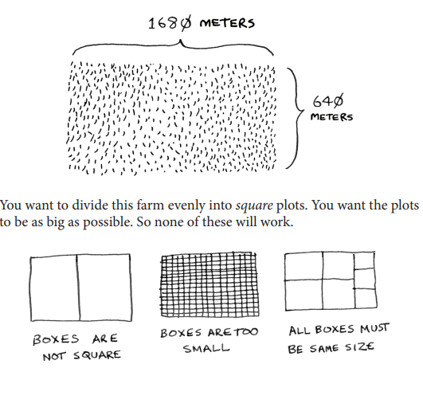

# Böl və hökm et strategiyası

Torpaq sahəsi üçün istifadə edə biləcəyiniz ən böyük kvadrat ölçüsünü necə tapırsınız? D&C strategiyasından istifadə edin! D&C alqoritmləri rekursiv alqoritmlərdir. D&C istifadə edərək bir problemi həll etməyin iki addımı var:

1.  **Əsas halı tapın.** Bu, mümkün olan ən sadə hal olmalıdır.
2.  **Probleminizi əsas hala gələnə qədər bölün və ya azaldın.**

Gəlin bu problemin həllini tapmaq üçün D&C-dən istifadə edək. İstifadə edə biləcəyiniz ən böyük kvadrat ölçüsü nədir? Əvvəlcə əsas halı tapın. Ən asan hal, bir tərəfin digər tərəfin misli olmasıdır.

---

## Original text (English)

# Divide and Conquer Strategy

How do you figure out the largest square size you can use for a plot of land? Use the D&C strategy! D&C algorithms are recursive algorithms. There are two steps to solving a problem using D&C: 1. Figure out the base case. This should be the simplest possible case. 2. Divide or decrease your problem until it becomes the base case. Let’s use D&C to find the solution to this problem. What is the largest square size you can use? First, figure out the base case. The easiest case would be if one side was a multiple of the other side.

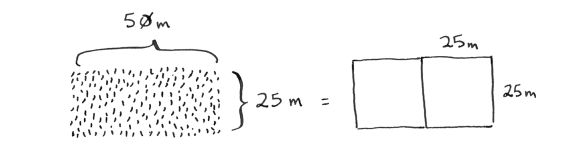
# Böl və hökm et: Rekursiv hal

Tutaq ki, bir tərəf 25 m, digər tərəf isə 50 m-dir. O zaman istifadə edə biləcəyiniz ən böyük qutu 25 m × 25 m-dir. Torpağı bölmək üçün bu qutulardan ikisinə ehtiyacınız var.

İndi rekursiv halı tapmalısınız. D&C burada işə düşür. D&C-yə görə, hər rekursiv çağırışla probleminizi azaltmalısınız. Burada problemi necə azaldırsınız? Gəlin istifadə edə biləcəyiniz ən böyük qutuları qeyd etməklə başlayaq.

---

## Original text (English)

# Divide and Conquer: Recursive Case

Suppose one side is 25 m and the other side is 50 m. Then the largest box you can use is 25 m × 25 m. You need two of those boxes to divide up the land. Now you need to figure out the recursive case. This is where D&C comes in. According to D&C, with every recursive call, you have to reduce your problem. How do you reduce the problem here? Let’s start by marking out the biggest boxes you can use.

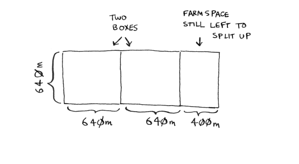
# Böl və hökm et: "Aha!" anı

Ora iki 640 m × 640 m qutu yerləşdirə bilərsiniz və hələ də bölünməli olan bir qədər torpaq qalır. İndi "Aha!" anı gəlir. Bölünməli olan bir ferma seqmenti qalıb. Niyə eyni alqoritmi bu seqmentə tətbiq etməyək?

---

## Original text (English)

# Divide and Conquer: Aha! Moment

You can fit two 640 m × 640 m boxes in there, and there’s some land still left to be divided. Now here comes the “Aha!” moment. There’s a farm segment left to divide. Why don’t you apply the same algorithm to this segment?

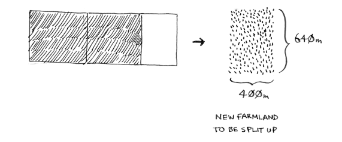
# Böl və hökm et: Problemin azaldılması

Beləliklə, siz 1,680 m × 640 m ölçülü bir fermadan başladınız ki, onu bölmək lazım idi. Lakin indi daha kiçik bir seqmenti, 640 m × 400 m-i bölməlisiniz. Əgər bu ölçü üçün işləyəcək ən böyük qutunu tapsanız, bu, bütün ferma üçün işləyəcək ən böyük qutu olacaq. Siz problemi 1,680 m × 640 m fermadan 640 m × 400 m fermaya qədər azaltdınız!

---

## Original text (English)

# Divide and Conquer: Problem Reduction

So you started out with a 1,680 m × 640 m farm that needed to be split up. But now you need to split up a smaller segment, 640 m × 400 m. If you find the biggest box that will work for this size, that will be the biggest box that will work for the entire farm. You just reduced the problem from a 1,680 m × 640 m farm to a 640 m × 400 m farm!
# Evklid alqoritmi

"Əgər bu ölçü üçün işləyəcək ən böyük qutunu tapsanız, bu, bütün ferma üçün işləyəcək ən böyük qutu olacaq." Əgər bu ifadənin niyə doğru olduğu sizə aydın deyilsə, narahat olmayın. Bu, aydın deyil. Təəssüf ki, onun niyə işlədiyinin sübutu bu kitaba daxil etmək üçün bir qədər uzundur, buna görə də sadəcə mənə inanmalısınız ki, o işləyir. Əgər sübutu başa düşmək istəyirsinizsə, ən böyük ortaq böləni tapmaq üçün Evklid alqoritmini araşdırın. Khan Academy-də yaxşı bir izahat var (http://mng.bz/orm2).

---

## Original text (English)

# Euclid's Algorithm

“If you find the biggest box that will work for this size, that will be the biggest box that will work for the entire farm.” If it’s not obvious to you why this statement is true, don’t worry. It isn’t obvious. Unfortunately, the proof for why it works is a little too long to include in this book, so you’ll just have to believe me that it works. If you want to understand the proof, look up Euclid’s algorithm for finding the greatest common denominator. The Khan Academy has a good explanation (http://mng.bz/orm2).

# Evklid alqoritminin tətbiqi

Gəlin eyni alqoritmi yenidən tətbiq edək. 640 m × 400 m ölçülü bir ferma ilə başlasaq, yarada biləcəyiniz ən böyük qutu 400 m × 400 m olacaq.

---

## Original text (English)

# Applying Euclid's Algorithm

Let’s apply the same algorithm again. Starting with a 640 m × 400 m farm, the biggest box you can create is 400 m × 400 m.
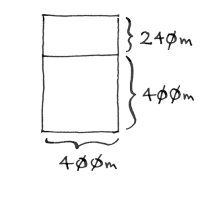

# Evklid alqoritmi: Kiçik seqment

Və bu sizə daha kiçik bir seqment, 400 m × 240 m ölçüsündə bir hissə buraxır.

---

## Original text (English)

# Euclid's Algorithm: Smaller Segment

And that leaves you with a smaller segment, 400 m × 240 m.

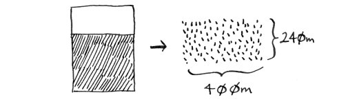
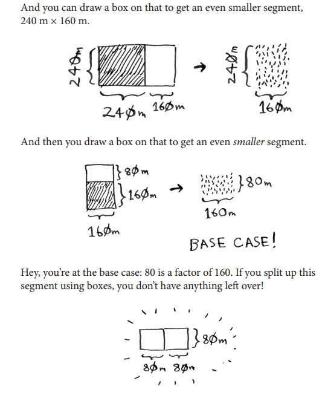
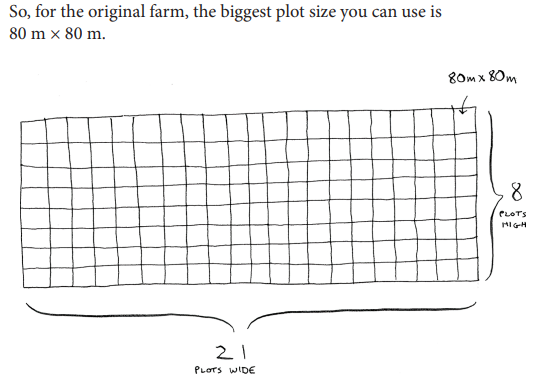

# Təkrar: Böl və Fəth et

Xülasə olaraq, Böl və Fəth (D&C) necə işləyir:
1. Əsas hal kimi sadə bir vəziyyət tapın.
2. Probleminizi necə azaltacağınızı və əsas hala necə çatacağınızı müəyyənləşdirin.

D&C bir problemə tətbiq edə biləcəyiniz sadə bir alqoritm deyil. Əksinə, bir problem haqqında düşünməyin bir yoludur. Gəlin bir nümunəyə daha baxaq.

---

## Original text (English)

# Recap: Divide and Conquer

To recap, here’s how D&C works:
1. Figure out a simple case as the base case.
2. Figure out how to reduce your problem and get to the base case.

D&C isn’t a simple algorithm that you can apply to a problem. Instead, it’s a way to think about a problem. Let’s do one more example.
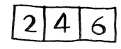
# Massivdəki ədədlərin cəmi

Sizə ədədlər massivi verilib. Bütün ədədləri cəmləməli və ümumi nəticəni qaytarmalısınız. Bunu dövrə ilə etmək olduqca asandır:

---

## Original text (English)

# Summing Numbers in an Array

You’re given an array of numbers. You have to add up all the numbers and return the total. It’s pretty easy to do this with a loop:
```py
def sum(arr):
 total = 0
 for x in arr:
 total += x
 return total
print(sum([1, 2, 3, 4]))
```
```js
function sum(arr) {
  let total = 0;
  for (let i = 0; i < arr.length; i++) {
    total += arr[i];
  }
  return total;
}
console.log(sum([1, 2, 3, 4])); // 10
```

# Massivdəki ədədlərin rekursiv funksiya ilə cəmi

Bəs bunu rekursiv funksiya ilə necə edərdiniz?

---

## Original text (English)

# Summing Numbers in an Array with a Recursive Function

But how would you do this with a recursive function?

# Rekursiv funksiya ilə massiv cəmi: Əsas hal

Addım 1: Əsas halı tapın. Əldə edə biləcəyiniz ən sadə massiv nədir? Ən sadə hal haqqında düşünün və sonra oxumağa davam edin. Əgər 0 və ya 1 elementli bir massiv əldə etsəniz, onu cəmləmək olduqca asandır.

---

## Original text (English)

# Summing Numbers in an Array Recursively: Base Case

Step 1: Figure out the base case. What’s the simplest array you could get? Think about the simplest case, and then read on. If you get an array with 0 or 1 element, that’s pretty easy to sum up.
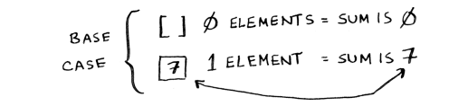
# Rekursiv funksiya ilə massiv cəmi: Problemin azaldılması

Beləliklə, bu, əsas hal olacaq. Addım 2: Hər rekursiv çağırışda boş bir massivə yaxınlaşmalısınız. Probleminizin ölçüsünü necə azaldırsınız? Budur bir yol.

---

## Original text (English)

# Summing Numbers in an Array Recursively: Problem Reduction

So that will be the base case. Step 2: You need to move closer to an empty array with every recursive call. How do you reduce your problem size? Here’s one way.
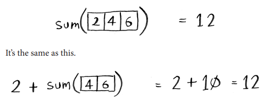
# Rekursiv funksiya ilə massiv cəmi: Nümunə

Hər iki halda da nəticə 12-dir. Lakin ikinci versiyada siz `sum` funksiyasına daha kiçik bir massiv ötürürsünüz. Yəni, probleminizin ölçüsünü azaltdınız! Sizin `sum` funksiyanız belə işləyə bilər.

---

## Original text (English)

# Summing Numbers in an Array Recursively: Example

In either case, the result is 12. But in the second version, you’re passing a smaller array into the sum function. That is, you decreased the size of your problem! Your sum function could work like this.
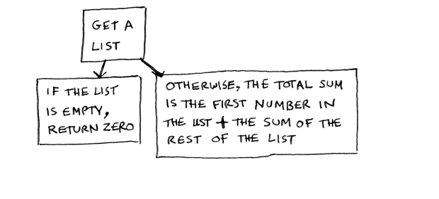
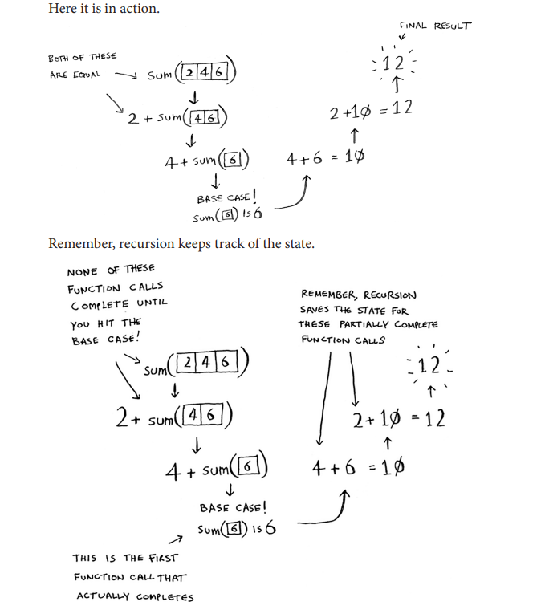
# Rekursiv funksiya ipucu

İpucu: Massivləri əhatə edən rekursiv funksiya yazarkən, əsas hal tez-tez boş massiv və ya bir elementli massiv olur. Əgər ilişib qalsanız, əvvəlcə bunu sınayın.

---

## Original text (English)

# Recursive Function Tip

Tip: When you’re writing a recursive function involving an array, the base case is often an empty array or an array with one element. If you’re stuck, try that first.
# Funksional proqramlaşdırmaya gizli baxış

"Dövrə ilə asanlıqla edə biləcəyim halda, niyə bunu rekursiv şəkildə edim?" deyə düşünə bilərsiniz. Yaxşı, bu, funksional proqramlaşdırmaya gizli bir baxışdır! Haskell kimi funksional proqramlaşdırma dillərində dövrələr yoxdur, buna görə də bu kimi funksiyaları yazmaq üçün rekursiyadan istifadə etməlisiniz. Əgər rekursiya haqqında yaxşı anlayışınız varsa, funksional dilləri öyrənmək daha asan olacaq. Məsələn, Haskell-də `sum` funksiyasını necə yazardınız:

---

## Original text (English)

# Sneak Peek at Functional Programming

“Why would I do this recursively if I can do it easily with a loop?” you may be thinking. Well, this is a sneak peek into functional programming! Functional programming languages like Haskell don’t have loops, so you have to use recursion to write functions like this. If you have a good understanding of recursion, functional languages will be easier to learn. For example, here’s how you’d write a sum function in Haskell:

# Haskell-də cəmləmə funksiyası

Diqqət edin ki, funksiya üçün iki tərifiniz var kimi görünür. Birinci tərif əsas hala çatdığınız zaman işləyir. İkinci tərif rekursiv halda işləyir. Bu funksiyanı Haskell-də `if` ifadəsindən istifadə edərək də yaza bilərsiniz:

---

## Original text (English)

# Sum Function in Haskell

Notice that it looks like you have two definitions for the function. The first definition runs when you hit the base case. The second definition runs at the recursive case. You can also write this function in Haskell using an if statement:
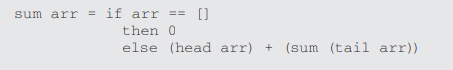
# Haskell: Rekursiyanın faydaları

Lakin birinci tərif oxumaq üçün daha asandır. Haskell rekursiyadan çox istifadə etdiyi üçün, rekursiyanı asanlaşdırmaq üçün bu kimi bütün gözəllikləri özündə cəmləşdirir. Əgər rekursiyanı sevirsinizsə və ya yeni bir dil öyrənməkdə maraqlısınızsa, Haskell-ə nəzər yetirin.

---

## Original text (English)

# Haskell: Benefits of Recursion

But the first definition is easier to read. Because Haskell makes heavy use of recursion, it includes all kinds of niceties like this to make recursion easy. If you like recursion or you’re interested in learning a new language, check out Haskell.

# TAPŞIRIQLAR

4.1 Əvvəlki cəmləmə funksiyası üçün kodu yazın.
4.2 Siyahıdakı elementlərin sayını saymaq üçün rekursiv funksiya yazın.
4.3 Siyahıdakı maksimum ədədi tapmaq üçün rekursiv funksiya yazın.
4.4 Fəsil 1-dəki ikili axtarışı xatırlayırsınız? Bu da bir Böl və Fəth (D&C) alqoritmidir. İkili axtarış üçün əsas halı və rekursiv halı tapa bilərsinizmi?

---

## Original text (English)

# EXERCISES

4.1 Write out the code for the earlier sum function.
4.2 Write a recursive function to count the number of items in a list.
4.3 Write a recursive function to find the maximum number in a list.
4.4 Remember binary search from chapter 1? It’s a D&C algorithm, too. Can you come up with the base case and recursive case for binary search?
\`\`\`

# Tapşırıq 4.1: Cəmləmə funksiyası (Həll)

Əvvəlki cəmləmə funksiyası üçün kod:

```python
def sum_recursive(arr):
    if not arr:  # Əsas hal: boş massiv
        return 0
    if len(arr) == 1: # Əsas hal: bir elementli massiv
        return arr[0]
    else: # Rekursiv hal
        return arr[0] + sum_recursive(arr[1:])

# Nümunə istifadəsi:
print(sum_recursive([1, 2, 3, 4])) # Çıxış: 10
print(sum_recursive([]))          # Çıxış: 0
print(sum_recursive([7]))         # Çıxış: 7

```

```py
def sum_recursive(arr):
    if not arr:  # Base case: empty array
        return 0
    if len(arr) == 1: # Base case: array with one element
        return arr[0]
    else: # Recursive case
        return arr[0] + sum_recursive(arr[1:])

# Example usage:
print(sum_recursive([1, 2, 3, 4])) # Output: 10
print(sum_recursive([]))          # Output: 0
print(sum_recursive([7]))         # Output: 7
```
# Tapşırıq 4.2: Siyahıdakı elementlərin sayını saymaq (Həll)

Siyahıdakı elementlərin sayını saymaq üçün rekursiv funksiya:

```python
def count_list_items(arr):
    if not arr:  # Əsas hal: boş massiv
        return 0
    else: # Rekursiv hal
        return 1 + count_list_items(arr[1:])

# Nümunə istifadəsi:
print(count_list_items([1, 2, 3, 4, 5])) # Çıxış: 5
print(count_list_items([]))             # Çıxış: 0
print(count_list_items(['a']))          # Çıxış: 1
```

# Tapşırıq 4.3: Siyahıdakı maksimum ədədi tapmaq (Həll)

Siyahıdakı maksimum ədədi tapmaq üçün rekursiv funksiya:

```py
def find_max_recursive(arr):
    if len(arr) == 1:  # Əsas hal: bir elementli massiv
        return arr[0]
    else: # Rekursiv hal
        sub_max = find_max_recursive(arr[1:])
        return arr[0] if arr[0] > sub_max else sub_max

# Nümunə istifadəsi:
print(find_max_recursive([1, 5, 2, 9, 3])) # Çıxış: 9
print(find_max_recursive([10]))           # Çıxış: 10
print(find_max_recursive([-1, -5, -2]))   # Çıxış: -1
```

```py
# Tapşırıq 4.4: İkili axtarışın əsas və rekursiv halları (Həll)

İkili axtarış (Binary Search) üçün əsas hal və rekursiv hal:

**Əsas hal (Base Case):**
*   Siyahı boşdursa: Element tapılmadı.
*   Siyahıda yalnız bir element varsa: Həmin elementin axtarılan dəyər olub-olmadığını yoxlayın. Əgər bərabərdirsə, tapıldı; əks halda tapılmadı.

**Rekursiv hal (Recursive Case):**
*   Siyahının orta elementini tapın.
*   Əgər orta element axtarılan dəyərdirsə: Element tapıldı.
*   Əgər axtarılan dəyər orta elementdən kiçikdirsə: Axtarışı siyahının sol yarısında davam etdirin.
*   Əgər axtarılan dəyər orta elementdən böyükdürsə: Axtarışı siyahının sağ yarısında davam etdirin.

---

## Original text (English)

# Exercise 4.4: Binary Search Base and Recursive Cases (Solution)

Base case and recursive case for Binary Search:

**Base Case:**
*   If the list is empty: The element is not found.
*   If the list has only one element: Check if that element is the target value. If it is, it's found; otherwise, it's not found.

**Recursive Case:**
*   Find the middle element of the list.
*   If the middle element is the target value: The element is found.
*   If the target value is less than the middle element: Continue the search in the left half of the list.
*   If the target value is greater than the middle element: Continue the search in the right half of the list.

```


